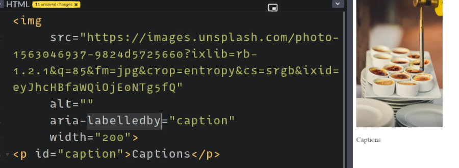

# A11y

## Semantic Web

- Make use of the appropriate HTML elements that impart meaning for the page.
- Do not use HTML elements for styling.

### Examples of inappropriate HTML Usage

- Using heading elements for bolding - they should only be used for marking sections in the correct order.
- Using anchor tags for buttons - they should be used only for links.
- Not using the `<nav>` element to encompass a list of navigation links. (Note, don't use aria-label="Navigation", because it SRs will ready "navigation" twice if you use a `<nav>` element.)
- Using the `title` attribute to provide tooltips is not very accessible, unless the tooltip provides different information.

> If you have to use elements such as `<div>` for other purposes such as button, then use the HTML attribute `role` to set its function (e.g. `role="button"`).

### Custom Form Controls

In the past, it was very popular to make custom form controls. However the problem with this approach is that you lose a lot of in-built a11y features provided by the browser.

If you have to take this approach, at least do the following:

1. Set the appropriate `role` to the element.
2. Set the tabindex to "0" if the element can be interacted with. **If the element is non-interactive, but must be able to be focused via Javascript, set the tabindex to "-1".**

## ARIA attributes

**Accessible Rich Internet Applications (ARIA)** is a set of attributes that define ways to make web content and web applications (especially those developed with JavaScript) more accessible to people with disabilities. These attributes typically start with the 'aria-' prefix.

> https://developer.mozilla.org/en-US/docs/Web/Accessibility/ARIA/ARIA_Techniques

### Examples

- `aria-label`: Gives elements a programmatic accessible name so that screen readers and other assistive technology can let the user know what the element will do once interacted with. This label is preferred by screen readers to describe an element.
- `aria-expanded`: Specifies whether the current element is expanded or not, if such functionality exists (e.g. like a hamburger menu)
- `alt`: Provides a text alternative description of a non-text element such as images and icons.
- `aria-hidden`: Hides the element from assistive technologies but is visible to sighted users.

#### Correct way of representing images

- The code below shows an image that is described by an accompanying caption.
- Instead of specifying it's `alt` attribute, which the screen reader would end up repeating both the `alt` text and the following caption, use the `aria-labelledby` attribute to point to the element ID describing the image. This way, the caption will only be read once.

> `alt` must be set to `""` because by default to filename will be read!



- If it's an image you can click, give it a `role="button` and `tabindex="0"`.

- Other roles are `main` (main content of the page), and `header` if you have a header.

## Outlines

- Any interactive elements should have an outline when focused or hovered.
- The outline should visible, have appropriate thickness and color (e.g. 4px and a colour that contrasts with the theme color of the page).

### Achieving an outline

```css
.btn-primary:focus,
.btn-primary:hover {
  background-color: black;
  color: gray;
  border-color: blue;
}

.btn-primary:focus {
  outline: 4px solid lime;
}
```

- For all elements of class `btn-primary`, on hover and focus, they will have different background and foreground color. Also, only on focus, they will have an outline.

## Tabindex

- You can navigate through interactive elements by using the tab key.
- This because these elements are automatically assigned a `tabindex`.
- `tabindex` indicates that an element is **interactive** and focusable. It's a violation of the standard for non-interactive elements to be focusable.
- To emphasize, the "Tab" key is used by disabled users to navigate between _interactive_ elements. Other shortcuts are used to navigate between other elements.
- When you set `tabindex="0"`, it simply indicates that the element is added to the tab tree - **not** the tab order.
- Using CSS `display:none` or HTML `hidden` attribute, removes the element from the tabindex.
- For the scenario where the element is **non-interactive**, but you want to be able to focus it at some point, set the `tabindex="-1"`. When you load the page, you won't be able to focus into the element using the Tab key, but you can focus it using Javascript.

## Skip Links (aka Bypass Blocks)

- Skip links are visually hidden links that take you different parts of a site. They are only visible when focused by the keyboard.
- This allows users to avoid having to tab through many elements to get to the main content.

The following code is how you'd implement a skiplink via CSS that is visually hidden unless focused by the keyboard:

```css
.skip a {
  position: absolute;
  left: -10000px;
  top: auto;
  width: 1px;
  height: 1px;
  overflow: hidden;
}

.skip a:focus {
  position: static;
  width: auto;
  height: auto;
}
```

> For more info on invisible content for a11y: https://webaim.org/techniques/css/invisiblecontent/

## ARIA regions

When you have content that dynamically changes, the screen readers should be set to announce these changes at the appropriate time.

This is achieved via ARIA roles.

This website gives a great overview on how it's done:
https://developer.mozilla.org/en-US/docs/Web/Accessibility/ARIA/ARIA_Live_Regions

## Navigation

- Use the `<nav>` element to group a list of page navigation links.

```html
<nav>
  <ul>
    <li class="nav-link active"><a href="#p1">Main</a></li>
    <li class="nav-link"><a href="p2">Products</a></li>
  </ul>
</nav>
```

- In the above code, how you'd traditionally highlight that a link is the currently selected page, is by adding a class "active" (or something similar).
- The a11y way to do is to instead use `aria-current="page"`. When you

```html
<nav>
  <ul>
    <li class="nav-link"><a aria-current="page" href="#p1">Main</a></li>
    <li class="nav-link"><a href="p2">Products</a></li>
  </ul>
</nav>
```

In CSS, if you wanted to select an element that is the currently active page, use the following:

```css
ul li a[aria-current="page"] {
  border: 4px solid yellow;
}
```
