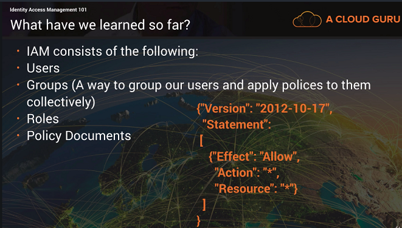
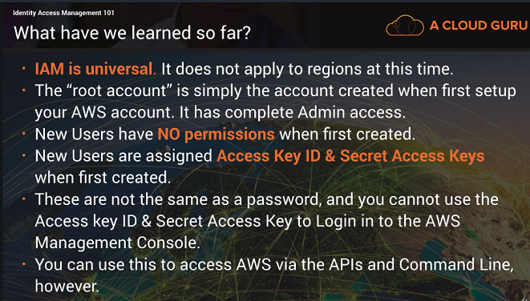
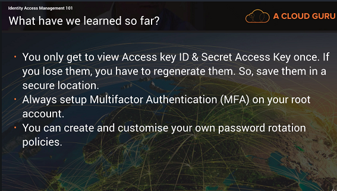

# Identity Access Management (IAM)

## What does it give you

- Centralized control of your AWS account
- Shared access to your AWS account
- Granular permissions
- Identity Federation (including Active Directory, Facebook, LinkedIn, etc.)
- Multifactor authentication
- Provides temporary access for users/devices and services as necessary (e.g. to access data in S3 buckets).
- Integrates with many different AWS services
- Supports PCI DSS compliance (for the payments industry)

## Critical terms

- **Users:** - end users
- **Groups:** - A collection of users under _one_ set of permisions.
- **Roles:** - A role is used to define a set of permissions, e.g. S3 bucket access. Roles are assigned to AWS resources.

## LAB

1. Login - make sure you set your local region (top right).
2. To access IAM, click on "Services" (top left) and find "IAM" under "Security".
3. You will be presented with a dashboard of security options to implement:
   - **Enable MFA** for your _root_ account.
   - **Create IAM roles** - Using your root account is discouraged unless the task cannot be completed without root access.
   - **Create groups** - And assign IAM roles to those groups.

### Adding a user

1. Click on "Users" on the left.
2. Add a new user.
3. There two ways the user can access: programmatic (CLI, API, etc) and AWS Console. You can select both if you want to.

> When creating a user with programmatic access, am **Access Key** and **Secret Access Key** are created. These are used for logging in programmatically.

> The **Secret Access Key** is only visible when you first create the user. If you lose it, you need to regenerate it.

### Modifying Users

1. Click on a user.
2. You get options to add specific permission policies or assign them to groups (which have a group of policies).

## Review

