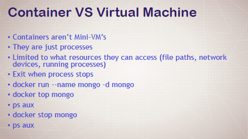
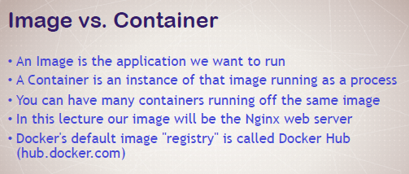
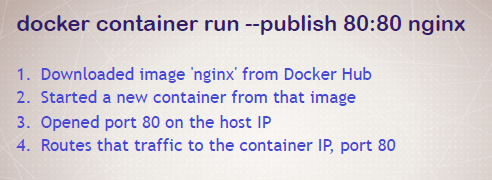
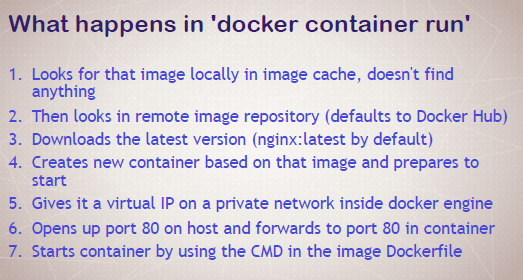

# Intro

## What is Docker

> Linux container technologies are lightweight mechanisms for isolating running processes so that they are limited to interacting with only their designated resources.  Many application instances can be running in containers on a single host without visibility into each others' processes, files, network, and so on. Typically, each container provides a single service (often called a "micro-service"), such as a web server or a database, though containers can be used for arbitrary workloads.

>The Linux kernel has been incorporating capabilities for container technologies for years. More recently the Docker project has developed a convenient management interface for Linux containers on a host. OpenShift and Kubernetes add the ability to orchestrate Docker containers across multi-host installations.

## Basic Commands

* **Typical Docker Command Structure**

Old:

`docker <command> (options)`

New:

`docker <command> <subcommand> (options)`

Task | Command 
--- | --- 
Check Version | `docker version`
See Engine Configuration | `docker info`

### Getting Help

* docs.docker.com
* `--help` (e.g.: `docker container logs --help`)

### Running Images

* Remember a **container** is an *instance* of an **image**.
* Everytime you start a new container, a **new ID** is generated.
* Also, if a `name` is not specified, a **random name** is generated (based on the names of famous scientists/hackers).
* Containers will share a read-only copy of an image. Each container will add its own layer of changes to the image.
* Containers will store data to be persisted on the host system. Containers themselves should be immutable or stateless. Patching/updating running containers is stupid. They are disposable - simply update the image, stop and delete the old containers and spin off the new updated containers.
* A key distinction between VMs and containers is that containers only load OS resources as needed - it relies on the underlying host system for all other resources.

#### Example of running an image

`docker container run --publish 8080:80 --name webhost -d nginx:1.11 nginx -T`

Option | Explanation
--- | ---
`--publish 8080:80`| Listen on port 8080 on **host** and forward to port 80 in container.
`--name webhost` | The name the container should *run as*.
`-d` or `--detach` | Run as background process
`nginx:1.11` | This is specificying the name of the container image to pull, as well as the specific version.
`nginx` | This changes the default CMD to run when the container starts

***Other Options***
Option | Explanation | Example
--- | --- | ---
`--env (val)` or `-e (val)`| Pass an environment variable into the container | `--env MYSQL_RANDOM_ROOT_PASSWORD=yes`
`-it` | Start a container interactively (access its shell)
`--rm` | Automatically remove the container when it exits

### Docker Start

**Scenario**
--------------
* I use `docker container run` to run an Ubuntu image interactively.
* I use `apt-get` to install `curl`.
* The container stops when I exit its shell.
* If I use `docker container run` on the Ubuntu image again, **this container will *not* have curl installed**.
* I have to use `docker container start CONTAINER` to start the container with `curl` installed in it.

### Container Management

Task | Command
--- | ---
Stop a running container| `docker container stop (list of container ids / name)`
Remove a container | `docker container rm (list of container ids / names)` (include `-f` to remove a container that is still running)
List *running* containers | `docker container ls` (include `-a` to show all containers)

### Inspect Containers

Task | Command
--- | ---
**List processes** in a container | `docker container top (container id/name)`
View a container's **configuration** | `docker container inspect (container id/names)`
View **performance stats** for a container | `docker container stats (container id/name)`

**Note:** 
* For `inspect`, you should filter the output using `--format`.
* Docker uses Golang templates for the formatting. See: https://docs.docker.com/config/formatting/

### Interacting with containers

Usage of Docker run:

`docker container run [OPTIONS] IMAGE [COMMAND] [ARG...]`

* `[COMMAND]` allows you to specify what command to run when the container starts (and overwrite the default). The default CMD for Ubuntu is bash. For nginx, it will be the nginx server.
* The container will only run as **long as the command takes to execute**. If you run `bash` and exit, the container will stop. Typically it will be a server that is executed, so it will keep running till you terminate it.

Task | Command
--- | ---
Start a new container **interactively** | `docker container run -it`
Run **additional commands** in an *existing running container*. | `docker container exec -it`