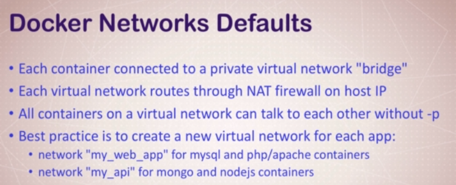

# Docker Networking Basics



* We don't need to use `--publish` for containers to talk to each other inside the host. That is only needed for connection with the network/internet.
* The idea of the Best Practice guideline, is that you can *separate* the virtual network for different groups of containers. None of these containers may need to be exposed to the internet. Furthermore, containers which need to talk to each other can be grouped into their own virtual network, isolating them from other groups of containers.
* You can create multiple virtual networks according to different security requirements.
* Containers can be attached to more than one virtual networks.
* By default, the container *does not* use the **same IP as the host**.
* You can *skip* virtual networks and use host IP: `--net=host`


## Inspect Port Forwarding from Host to Container

`docker container port CONTAINER`

## Inspect the IP Address of a Running Container

`docker container inspect --format "{{ .NetworkSettings.IPAddress }}" CONTAINER`

## Docker Network Commands


## Inspecting Networks


* **bridge**: The default network that bridges through the NAT firewall to the physical network your host is connected to. Containers by default attach to this.
* **host**: Skip the virtual network and connect directly to the host network. Only useful for high performance or compatibility requirements.
* **none**: Equivalent of having an interface on your computer not attached to anything.

### To inspect what containers are attached to a virtual network

`docker network inspect VNET_NAME`

Scroll down to the "Containers" field to see the names of the containers attached to the network.

## Create Your Own Docker Network

`docker network create VNET_NAME`

* This will by default use the **bridge** driver.

## Run a new container on a specific Docker Network

Example:

```bash
docker container run -d --name new_nginx --network my_vnet nginx
docker network inspect my_vnet
```

You will now see `new_nginx` added to the `Containers` field.


## Attach a Docker Network to an existing container

```bash
docker network connect VNET_ID CONTAINER
docker container inspect CONTAINER
```

You will now see the new virtual network in the `Networks` field.

* To disconnect, simply do the same using `docker network disconnect`

------------------------------
# Docker Networks: DNS

* **Using Static IPs is an *Anti-Pattern***. Do not use it.
* We can't rely on IP Addresses to reliably talk to containers as they are just *too dynamic*.
* **DNS Naming** is used to manage this.
* Docker uses **container names** as the *equivalent* of a **hostname** for containers talking to each other.
* The Docker daemon has a built-in DNS server that containers use by default.

**Important Note:**

* A disadvantage of the bridge network is that by default, *it does not have the Docker DNS server*.
* To solve this, use the `--link CONTAINER` to link the container to another.
* **It's much easier to just create a new virtual network and attach containers to it.**


## An Example

**Scenario**

* You run two containers, `my_nginx` and `new_nginx`.
* You create a new virtual network.
* You attach each of them to the same virtual network.
* You run: `docker container exec -it my_nginx ping new_nginx`

> You will see the output for a successful ping! Docker resolves the container name `new_nginx` into the correct IP in the virtual network!

