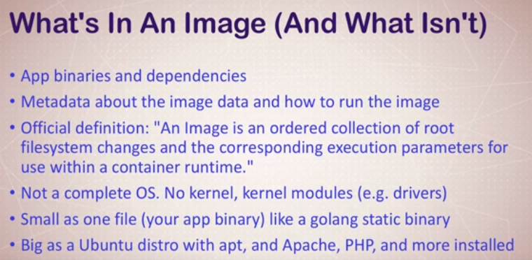
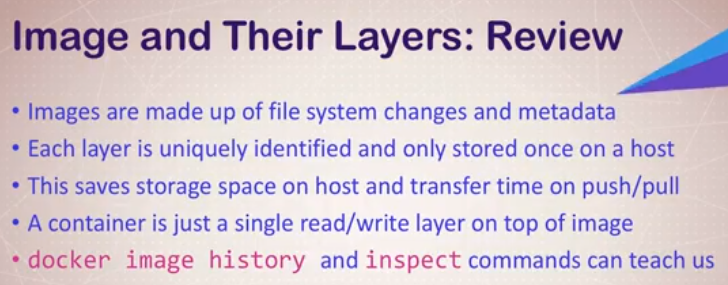

# Docker Images



* Best practice is to specify the exact version of the image you want to use.
* If you see the word `alpine` in a image repo, its a distribution of Linux that's really small.
* The image ID is a SHA of the image. It's not uncommon to have images of different tags but have the same SHA - because they are the same image.
* To see the history of an image (changes made to it): `docker image history IMAGE:version`
* A Docker image is comprised of layers. Different images that have the same layers will share those layers (image data layers are not duplicated).
* A container has an additional layer on top of the image. So a container is an immutable image + changes.



* **Images don't have a name**. To refer to them, we have to rely on two pieces of information: the repository name and the tag. 
* A tag is not quite a version or a branch, but it is similar to git tags. It's a pointer to specific image commit (ID).
* Only official repositories do not have their account name in front of the repo name (i.e the format `account-name\repo-name`).
* Official repositories are managed by both Docker and the company creating the image.

* It is possible to re-tag existing Docker images:

`docker image tag SOURCE_IMAGE[:TAG] TARGET_IMAGE[:TAG]`

e.g.:
`docker image tag nginx bretfisher/nginx`

*If you omit the tag, it defaults to latest.*


# Building Docker Files

## The Docker File
E.g.:
```dockerfile
FROM debian:stretch-slim

ENV NGINX_VERSION 1.13.6-1~stretch
ENV NJS_VERSION   1.13.6.0.1.14-1~stretch

RUN apt-get update \
	&& apt-get install --no-install-recommends --no-install-suggests -y gnupg1 \
	test -z "$found" && echo >&2 "error: failed to fetch GPG key $NGINX_GPGKEY" && exit 1; \
	apt-get remove --purge -y gnupg1 && apt-get -y --purge autoremove && rm -rf /var/lib/apt/lists/* \
	&& echo "deb http://nginx.org/packages/mainline/debian/ stretch nginx" >> /etc/apt/sources.list \
	&& apt-get update \
	&& apt-get install --no-install-recommends --no-install-suggests -y \
						nginx=${NGINX_VERSION} \
						nginx-module-xslt=${NGINX_VERSION} \
						nginx-module-geoip=${NGINX_VERSION} \
						nginx-module-image-filter=${NGINX_VERSION} \
						nginx-module-njs=${NJS_VERSION} \
						gettext-base \
	&& rm -rf /var/lib/apt/lists/*

RUN ln -sf /dev/stdout /var/log/nginx/access.log \
	&& ln -sf /dev/stderr /var/log/nginx/error.log

EXPOSE 80 443
```

* A Dockerfile must images must start with a `FROM`, usually from a minimal Linux distribution like debian or (even better) alpine.
* If you truly want to start with an empty container, use `FROM scratch`,
* Minimal distributions of Linux are preferred because they're small and you install what you need using their package managers.
* `ENV` is used to set the environment variable in the container.
* `RUN` is used to execute shell commands.
* The **second** `RUN` command shows re-direction of log files to stdout and stderror.
* The *proper* way to **log** a file is to re-directo **stdout** and **error**, *not* writing to a file.
* `EXPOSE` opens ports *within* the container.
* `CMD` is a required parameter. It is the final command that is run when you start a new container or restart a stopped container.

## Building the Dockerfile

`docker image build -t NAME .`

* The dot (.) means use this current dir as the build dir.
* The Dockerfile must be present.
* Since you're using the image locally, you can call it what you want instead of `account-name\name:tag`
* **The ordering of your commands in the Dockerfile is important**.
* Therefore things that change the **least** must be on *top* of the file, and the things you change the **most** at the *bottom*. Otherwise Docker will rebuild your entire image.

### Other Dockerfile Config

`WORKDIR /usr/share/nginx/html`

* This is used to basically execute `RUN cd /some/path`, and is preferred to executing `RUN` when setting your working directory.

`COPY index.html index.html`

* This copies a file from *locally* to the *container*, **where ever you current working directory is**.

