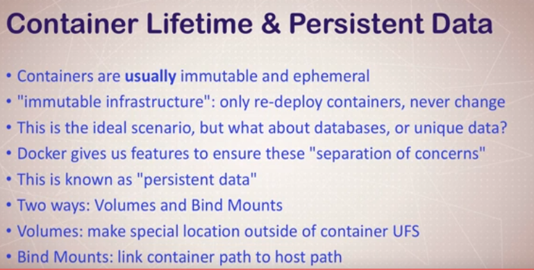
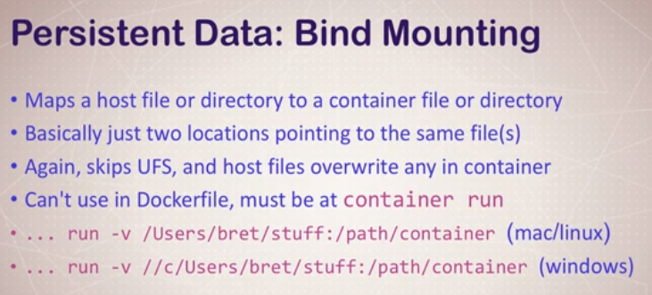

# Container Lifetime & Persistent Data

https://docs.docker.com/storage/

* Volumes allow you store unique data across container removals. 
* Bind mounts: sharing/mounting a host dir or file into a container. 
* Both of the above look local to the container.

* **Volumes** are stored in a part of the host filesystem which is managed by Docker (/var/lib/docker/volumes/ on Linux). Non-Docker processes should not modify this part of the filesystem. Volumes are the best way to persist data in Docker.
* **Bind mounts** may be stored anywhere on the host system. They may even be important system files or directories. Non-Docker processes on the Docker host or a Docker container can modify them at any time.
* **`tmpfs` mounts** are stored in the host system’s memory only, and are never written to the host system’s filesystem. It can be used by a container during the lifetime of the container, to store non-persistent state or sensitive information. For instance, internally, swarm services use tmpfs mounts to mount secrets into a service’s containers.

## Docker Command

`VOLUME /path/in/container`

* The above command in the Dockerfile says to create a new volume for the path in the container, which will persist data across containers.
* Volumes require manual deletion, simply removing a container doesn't remove the volume.
* Run `docker volume prune` to cleanup unused volumes.

`docker container inspect IMAGE`

* Navigate to Volumes to see the local container path for persistent data.
* Navigate to Mounts to see the mapping of host location to container location of persistent data.
* Only on Linux can you navigate to the actual host location. It's more complicated on Windows, as it's actually inside a Linux Hyper-V VM.
* 

`docker volume ls`

* This will show all the available volumes. However their names will be unfriendly.

#### Named Volumes

Creating a friendly volume name for volumes:

`docker container run -v VOLUME_FRIENDLY_NAME:/path/in/container IMAGE`

#### Review

* You can specify volumes in the `Dockerfile` or in `container run`.
* You can create volumes in advance, but that's another matter which requires drivers.

## Bind Mounting

