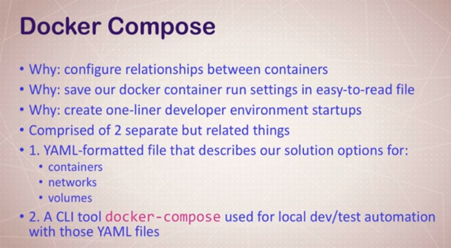

# Docker Compose

* Our application containers will often require other containers - such as DB containers.
* Docker compose is a way of managing the running and coordination of multiple containers.
* If you don't name your compose file `docker-compose.yml`, you need to manually add the file using `-f path/to/file.yml` or set an environment variable.





```bash
docker-compose ps # To see running docker services (containers)
docker-compose up # Start up your docker-compose file
docker-compose down # Shut down your running compose containers
docker-compose top # See the processes running in your containers
```


