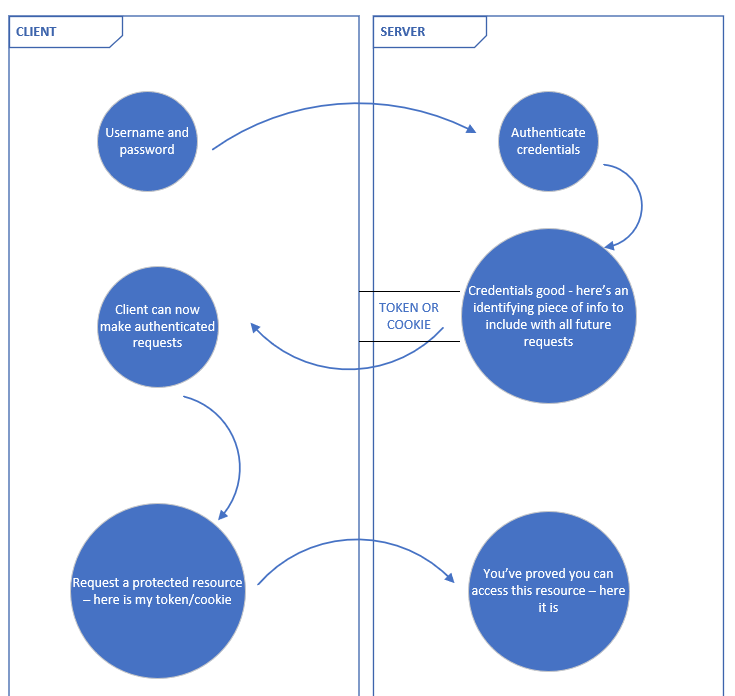
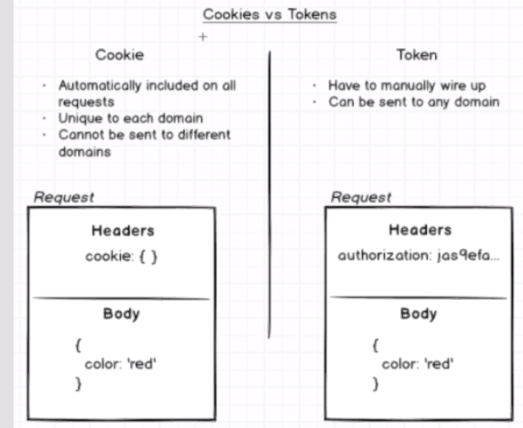
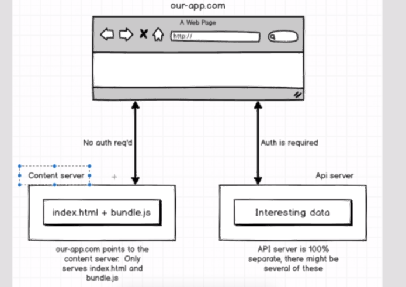
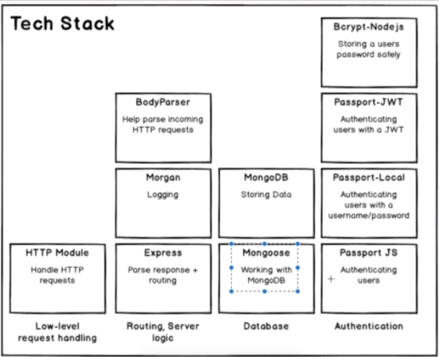
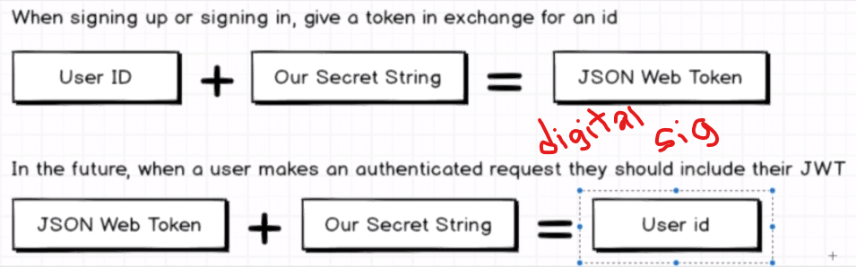
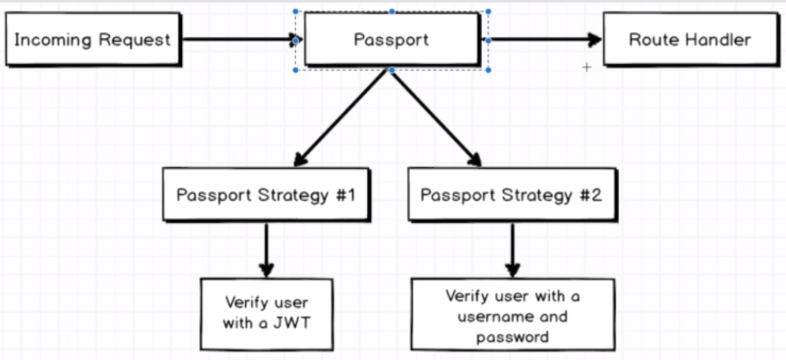

# Authentication

## Typical Authentication Flow

## Cookies vs Tokens

- HTTP is a stateless protocol, cookies are a way of including state in it.
- Cookies cannot be sent to different domains (e.g. Google cookies can't be sent to ebay)
- Tokens are more of an idea. They have their own implementation.
- Tokens are used for very large applications that need to scale. They also have the benefit that they're not domain specific.
- Industry is trending to tokens.

## Scaleable Architecture

- The reason to the trend towards cookies is that you can have webapps, mobile apps and protected/unprotected APIs. They may not necessarily belong to the same domain.

## Backend Tech Stack Example for NodeJS

## JWT

- In the object we encode with our secret, by convention we use a field called `sub` (short for subject). Subject is used to identify who the token is about.
- We also include a timestamp for a property called `iat`, which means issued at. We can use it to invalidate expired tokens.

### Passport

Passport is an authentication 'ecosystem'.

The following diagram shows how passport strategies are used for authenticating JWT strategies:

You can plugin different passport strategies depending on the kind of authentication you want.
