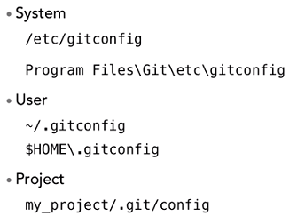
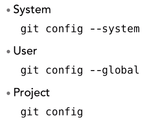
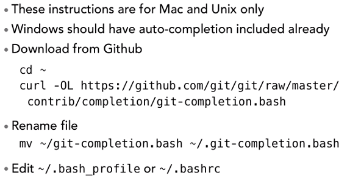
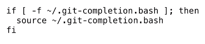

# Git Essentials - Getting Started

* There are three scopes of configuring Git:



* You don't need to modify the config files directly! Instead, you can use commands, using the following format:



* Don't let **global** confuse you - it's global to the *user*.
* You generally shouldn't touch **system** config.
* When you `git init`, it will create a .git folder. This is where *all* tracking info is stored.

## Common Git Config Commands

> git config --global user.name "Jithya Nanayakkara"

> git config --global user.email "someone@nowhere.com"

> git config --list //Lists your configuration

> git config --global core.editor "Code" //Set the editor to VS Code

> git config --global color.ui true //Sets Git to use colors in its output

## Including Git AutCompletion for Mac/UNIX

Windows already has auto complete.
For Unix, download the git-completion.bash file, prepend it with ".", then load it by editing your user profile (.bashrc):






## Git Basics

> git init

> git add . //Stage every change made in the current directory

You will always have the same basic flow:
1. Make a change.
1. Add the change.
2. Commit the change with a message.

> git commit -a

The above will add and commit. There are two caveats however:
1. It will add **all** files.
2. Files that are **not tracked** and files that are **deleted** will ***not* be included**.
Therefore, it works well for modifications, not for new or deleted files.

When you stage a file, and then make some changes, those **changes will not be captured in the staging**.
Best practice is to treat it as separate commits - why? Because each commit should encapsulate a specific change.


## Git Log 

```
git log // Returns all log messages, in the format: Commit ID, Author (email), Date, Commit Message

git log -n 1 // Returns the top 1 commit messages (can replace with any number)

git log --since=YYYY-MM-DD //Returns all commits after (exclusive) the specified date (you can use after instead of since too!)

git log --until=YYYY-MM-DD //Returns all commits before (exclusive) the specified date

git log --author="Jithya" //Returns all commits by an author (doesn't have to be full name)

git log --grep="regex" //Searches all commit messages that matches the regex


git log --oneline // Returns only the first line (and SHA) of all commit messages.

git log --oneline -{number} // Limit the commits to n number of commits

git log {SHA_VAL1}..{SHA_VAL2} // Shows all commits from SHA val 1 to SHA val 2

git log {SHA_VAL}.. filename.txt // Give all the commits since SHA_VAL that affect filename.txt

git log -p // Gives you a diff of every commit (what changed in every commit)

git log -p {SHA_VAL}.. filename.txt // List every change that happened to filename.txt since commit SHA_VAL

git log --stat --summary // Gives you statistics of what changed (insertions, deletions, etc) in each file, as well as a one line summary of those modifications

git log --format=fuller

git log --oneline --graph --all --decorate // A compact graph of all the branches

git log branch_name //show log for a branch
```