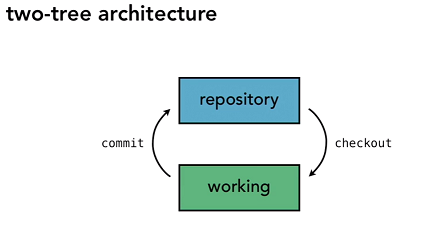
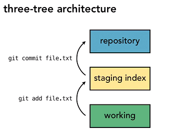
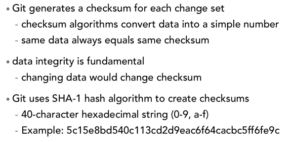
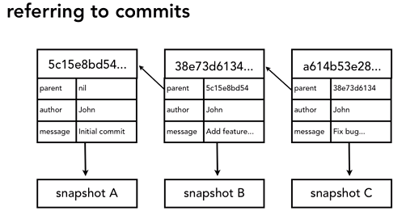
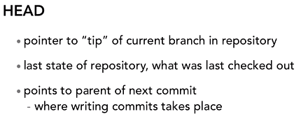

# Git Essentials - Architecture

* Git uses a 3 Tree Architecture, most other VCSs use 2 Tree Architecture.

* We call them *trees* because they represent a file structure.

* The power of the Staging Index is that if you have made changes to 10 files, but you only want to **commit 5** of them as *one changeset*, you add the 5 to the staging index and then commit.

* A Git **changeset** is a *snapshot* of the changes made, not anything to do with files or versions of files.

* Unlike other VCSs, Git checks the integrity of every commit:

* Every commit is attached with a checksum, and a pointer to its parent (predecessor commit):

 * Git maintains a variable called HEAD:

 

 