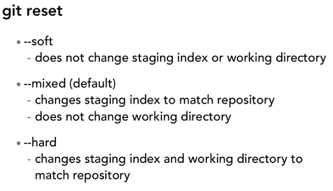
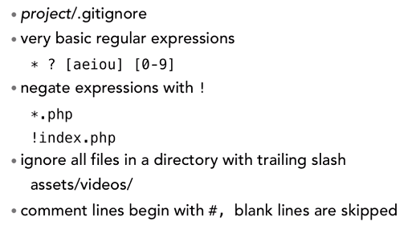

# Git Basics

> git status // Tells you the difference between the 3 trees: working dir, staging index and repo

> git diff // Shows you the changes between your working directory and the HEAD in the repository

> git diff --staged // Compare what's in the staging index to the repository

> git diff filename.txt // Shows only the changes in that single file, compared to HEAD

> git diff -color-words filename.txt // Only highlights the words changed, not the lines

## Deleting

* Deleting untracked files will have no effect on the repo.
* Use `git rm filename.txt`
* If you have deleted the file manually, you will have to use the above command to remove the file also from the repo.
* You have to **commit** the delete.
* **Note**: If you use git rm directly, it does not send the file to trash.

## Renaming and Moving

* If you manually rename a file, git tracks it as a delete and an addition of a new file.
* To reflect the change in the repo, you have to `git rm` the **old filename** and `git add` the **new filename.**
* If the file contents are at least 50% the same, the staging index will recognize it as a rename.
* An easier way is to simply use `git mv` for moving and renaming files.
* Moving and renaming is synonymous in Git.


## Checkout

* What `git checkout something` does, is that it looks at the repo and retrieves the thing named in the checkout to you.
* "something" could be a file or a branch - **git can't tell the difference!**. 
* By default, it would checkout a **branch**.
* **IMPORTANT**: When you want to checkout a file, best practice is to use `git checkout -- filename`.
* A bare "--" signifies stay on the current branch.


## Messing with commits

### To unstage a file

> git reset HEAD filename.txt

The above command sets the given file in staging to the version of the last commit (HEAD) - i.e. undoing your staging.

### Ammending commits

It's not possible to ammend any commit. This is because every changeset includes its parent hash, which is used to produces its own hash.
So ammending a random commit will corrupt all the following commits, as that commits hash value would change.

However, you can ammend the *last* commit. This is because it has no child commit, so there is no corruption in the history.

A scenario when you would ammend a commit, is when you commit your work, but then forgot to include another file, or had a follow-up change that belongs to that last commit.

To add that change to the last commit:
1. Add the changed file to staging.
2. Type `git commit --amend -m "your message"

**Note:** The mesage provided will overwrite the old commit message. You can copy the old commit message from the git log if you want to preserve it.

### Retrieving old versions

* You can't change old commits. Doing so would violate data integrity.
* The best way to fix a commit, is to make a new commit. This means a record of your mistake would be made, which is the point.

To retrieve an old version:

1. Grab the old commit hash from git log (you don't need the full hash, generally the first 10 chars are guaranteed to be unique).
2. `git checkout {hash-value} -- {filename.txt}`
3. The file gets checked out to your **staging index**. You can run a `git diff --staged` to see the changes between staging and the repository.
4. If you commit the staged file, it would commit the old file as the latest version. Best practice is to include the reference SHA value with the commit message.


### Using Revert instead of Checkout for going back to an old version

This is used when you want to undo the changes for a commit, completely and totally.
It's important to understand that a revert negates all the changes you applied in a commit.

1. Grab the SHA value of the commit you want to revert to.
2. Type `git revert {SHA-VALUE}`
3. By default, the git commit message will be something like "This reverst commmit {SHA}".

This is useful when you want to undo simple changes.
When you want to do undo a complex change, you will be merging the current branch with a new set of changes.

### Git Reset

Git Reset moves the HEAD pointer, to point to some commit.
It essentially allows you to rewind your commits, and destroy all the existing following commits.

**WARNING:** This is the most dangerous option, as it allows you to *destroy* your work!

There are three types of resets:



* `--soft` is safe, as it only affects your **repository**. The HEAD in the repo is rewound back to a previous commit, but all the existing work is preserved in staging and your working directory.
* `--mixed` is the default, and it affects both the **repository** and your **staging index**.
* `--hard` is the most destructive - it affects all three trees, so your working directory loses all its state and goes back to the previous commit.

1. Use `git log` to grab an old commit SHA.
2. Type `git reset --[soft/mixed/hard] {SHA}`


### Undoing all your work in your working directory to your last commit

> git reset --hard HEAD

This is more convenient than checkout files.


### Getting rid of all UNTRACKED files using Clean

Say you have a large amount of files generated, such as log files, compiled artifacts, etc.

1. `git clean -n` // This will do a *test* run of a clean - it lists everything that will be deleted.
2. `git clean -f` // This will actually delete all untracked files.


## Git Ignore

**Go to the following website to see example .gitignore for each programming language:**

https://github.com/github/gitignore

* You put a .gitignore file in the **root** directory.
* Alternatively, you can create a user scoped .gitignore, in your user directory. The filename is `.gitignore_global`. Then type the following:
> git config --global core.excludesfile {fullpath to filename}

* It supports very basic regex.
* You can tell it to *not* ignore files by prepending a "!". This is useful when you're ignoring a bunch of files of the same type, but want an exception.
* .gitignore **must** be commited.
* .gitignore will **not** ignore files that are *already tracked*. You have to *first stop tracking it*. One way is to use `git rm`. The way to remove it from the staging index is to use `git rm --cached filename.txt`. Then commit it.




### Important Note

Git does not track empty directories!

To ensure an empty dir is tracked, by convention we put an empty file called `.gitkeep`.

### Example .gitignore

#### Compiled source #

```
*.com
*.class
*.dll
*.exe
*.o
*.so
```

#### Packages #

**it's better to unpack these files and commit the raw source git has its own built in compression methods**

```
*.7z
*.dmg
*.gz
*.iso
*.jar
*.rar
*.tar
*.zip
```

#### Logs and databases #

```
*.log
*.sql
*.sqlite
```

#### OS generated files #

```
.DS_Store
.DS_Store?
._*
.Spotlight-V100
.Trashes
ehthumbs.db
Thumbs.db
```