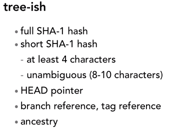
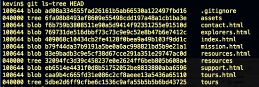

# Git Intermediate 

## Navigating the commit tree

* In Git, `tree-ish` is a reference to a commit in the commit tree.

What could a tree-ish be?



* How do you specify a parent commit (ancestry)?

> HEAD^, {SHA_VAL}^, master^ // ^ means parent
> HEAD~1, HEAD~ //~{number} means how many generations before

* How do you specify a grandparent commit (ancestry)?

> HEAD^^, {SHA_VAL}^^, master^^
> HEAD~2

* How do you specify a great-grandparent commit (ancestry)?

> HEAD^^^, {SHA_VAL}^^^, master^^^
> HEAD~3

* What does git ls-tree do?

> It lists out all the files in the repo for the given commit.
> You use git ls-tree by passing it a tree-sh i.e. a commit reference



## Examine Commits

> git show {SHA_VAL} //diff of the commit between before and after

## Ignore Space Changes in Diffs

> git diff -w

## Stashing

* Stashing is a separate "fourth" area of Git. It stores snapshots, but it is not the same as commits, and does not store an associate SHA.
* The stash remains the same regardless of the branch you're on, but it is for your local repo only.

When you have uncommited changes to stash:
> git stash save "save message"

When you stash your changes, **git reset HEAD --hard** is run!

**Note:** If you want to include untracked files, you have to pass in a switch (refer manual).

* To view what's in your stash:
> git stash list

You will find a list of stashes, preceded by an ID of format `stash@{num}`, where num is the stash number.
You refer to each stash by `stash@{num}`.
E.g. `stash@{0}`


* To view the diff stat of a specific stash:

> git stash show `stash@{0}`

A more detailed diff:

> git stash show -p `stash@{0}`

### Retrieving a Stash

Two methods:

1. `git stash pop [stashid]`

Pops out the most recent stash (if the stash id is omitted) and **deletes** it.

2. `git stash apply [stashid]`

Applies the most recent stash (if the stash id is omitted) to your repo and **preserves the stash**.
This is used when you want to apply your stashed changes to multiple branches.


### Deleting a Stash Item

To delete a specific stash:
> git stash drop stash@{n}

To delete everything:
> git stash clear // does not check with you before destroying everything!


## Adding Git Command Aliases

**Not recommended for beginners!**

* Best to edit the global (user) scoped config.
E.g.
`git config --global alias.st status`

Now if you type `git st`, it's the same as `git status`.

### A Popular Set of Aliases
```bash
git config --global alias.co checkout
git config --global alias.ci commit
git config --global alias.br branch
git config --global alias.dfs "diff --staged"
git config --global alias.logg "log --graph --decorate --oneline --abbrev-commit --all"
```
