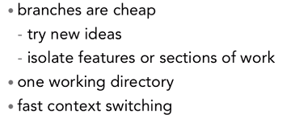
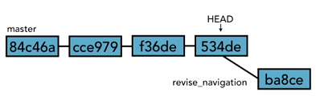
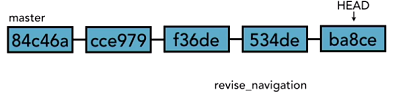
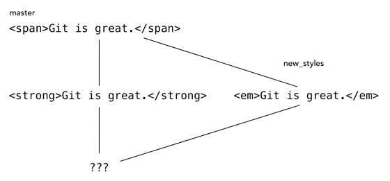
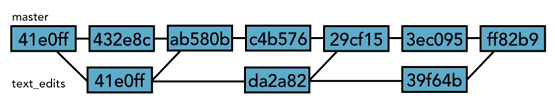
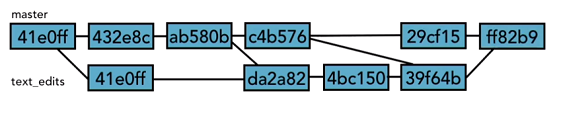

# Branching

* In Git, branches are cheap - they don't take a lot of space, processing part, easy to delete and create.

## Important Note about HEAD

* When you create a new branch from master, HEAD still points to the master branch.
* But when you make a new commit to the new branch, HEAD will move to the new commit.
* If you switch between branches, HEAD will switch to the tip of the current branch.

## Branch Basics

Show current branch
> git branch 

Creates a new branch off of current branch, but stays in the current branch
> git branch new_branch_name

Switch to an existing branch
> git checkout new_branch_name

Create a new branch from a specific point - another branch, a commit
> git branch new_branch [existing_branch | HEAD | commit_SHA]

Create  AND switch to a new branch
> git checkout -b new_branch_name

Rename a branch. You can use with -m or --move
> git branch -m branch_name another_branch_name 

Deletes a specified branch. You cannot delete branches you're currently on. You need to use -D if you want to delete an unmerged branch.
> git branch -d branch_to_delete 

### Switching

* You have to either commit or stash changes before you can switch.
* However if you have **untracked** files, they won't be touched when switching, so you can switch freely.

### Comparing branches

> git diff master..new_feature_branch

Diffs between the tips of master branch and new_feature_branch

* **How do you find out what branches a branch is comprised of?**

> git branch --merged

If a branch X is comprised of multiple branches, if you delete one of those branches, branch X will still have that deleted branch's commit.

## Configuring Command Prompt to Show Which Branch You're On

### UNIX

* Make sure you have installed the bash completion script.
* UNIX stores its prompt in a variable `PS1`. You can view by `echo $PS1`.
* To modify your prompt use: `export PS1='blah'`
* To do your branch name for git:

> export PS1='\W$(__git_ps1 "(%s)") > '

You need to edit your .bash_profile or .bashrc file with the above line (but *after* you've loaded the source code for bash_completion).

## Merging Branches

1. First checkout to the *receiving* branch.
2. Type `git merge branch_to_merge`
3. Verify with `git branch --merged`
4. Optionally, delete the merged branch: `git branch -d branch_to_merge`

### Fast-forward vs True merge

When your master branch has **no new commits**, it can be merged with another branch by using a fast-forward commit.
This simply moves the HEAD pointer of master to the HEAD of the merging branch.
It does not do any **new commits**.

If you want to force Git to make new commits with the merge (for log history reasons), use the `--no-ff` switch:
> git merge --no-ff branch_name

If you want to force Git to only use fast-forward merge `--ff-only` switch (if it **can't**, it will **abort the merge**):
> git merge --ff-only branch_name

If your master branch experienced commits, so its HEAD is no longer a commit shared with the merging branch, a true merge will be applied.

## Merging Conflicts

A conflict occurs when there are two changes to the same set of lines in two different commits.
Git can't decide which commit to use when merging the branch.

* When you merge and receive a conflict, your branch switches to an intermediate branch - (CURRENT_BRANCH | MERGING). This indicates you're in a branch which is still merging changes.
* Type `git status` in this branch to see the conflict files.
* The conflict file is marked with two sections - one from the current branch, the other from the merging branch.

### Resolving Merge Conflicts

There are three approaches:
1. Abort the merge.
2. Resolve merge manually.
3. Use a Merge Tool.

#### Abort the merge

> git merge --abort

#### Resolve Merge Manually

1. Merge the conflict file manually.
2. Delete the sections you'd don't want.
3. Git add conflict file.
4. Git commit.

#### Use a mergetool

> git mergetool

This will give you some options of merge tools to use.

## Strategies to Reduce Conflicts

* Keep code line short.
* Keep commits small and focused.
* Don't make unnecessary edits to whitespace.
* Merge often (not always practical).
* **Track changes to master** - i.e. keep your branch in sync with master.

**Bad Practice:**

**Good Practice:**

The point of the above, in the good practice, is that the feature branch `text_edits` is in sync with changes to `master` until it is finally merged into `master`.
In bad practice, no syncing is done with `text_edits`, and as time goes on, the probability of complex merge conflicts increase.

