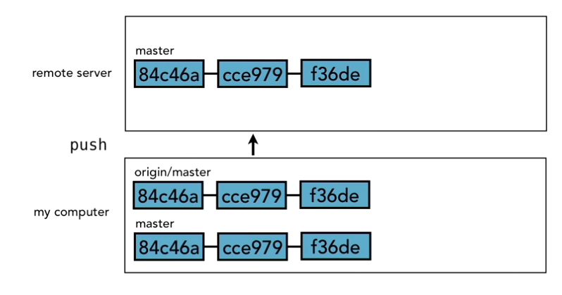
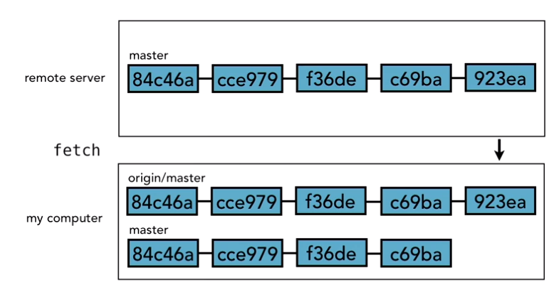
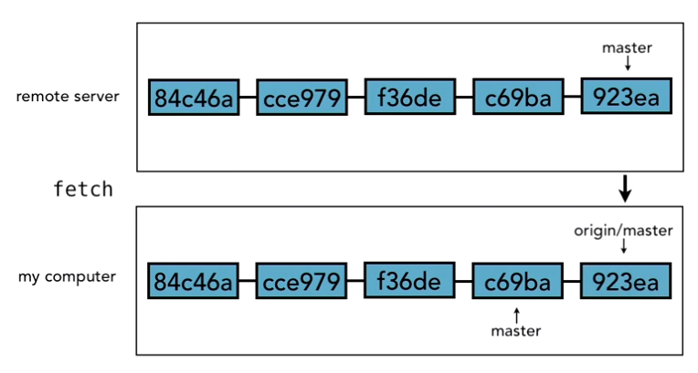

# Remotes

* Let's say on your local branch, you create a `master` branch. The remote server is empty (but initialized). When you push your changes, the remote server will create a new `master` branch with your commited files.
* At the same time as the push of the branch, git will create a new branch called `origin/branch_name`, in the local repository, where branch_name is the name of the branch you pushed. In this example, it's `origin/master`.
* This new branch name `origin/master` is by convention/default, and you can change this behaviour. `origin/master` references the remote server branch, and tries to be in sync with it.

* When you execute a `git fetch`, changes in the remote or pulled into the `origin/master` branch but **not** the `master` branch.

* The above illustrations, show how things work *conceptually*. In actuality, Git maintains different pointers to manage the different branches, as shown below.

**Note:** You can't checkout tracking branches, though everything else about it is identical to a git branch.

## Workflow with Remotes

**Note:** When cloning repositories, you can choose which branch to clone. By default, the master branch is cloned.

1. Do commits locally.
2. Fetch latest from remote server - get your `origin` branch in sync.
3. Merge your `origin` branch into your working branch.
4. Push the result back on to the remote server.

## Adding a Remote

> git remote -v

This will give you a list of all remotes it knows about.
We use -v for verbose to icnlude the URL.

> git remote add {alias} {url}

This will add a URL as a remote, with an URL.
By default, we call the primary repository `origin`.
Remote information is now stored in .git/config

> git remote rm {alias}

This will remove a remote.

## Creating a Remote Branch

> git push -u {remote alias} {branch name}

Typically in instructions for intializing remotes, you will see:
> git push -u origin master

This pushes the `master` branch to the `origin` remote.
The `-u` option sets up another branch to track the branch on `origin`.

> git branch -r 
This will show you remote branches.

> git branch -a
This will show you both remote and local branches.

## Tracking Remote Branches

When you use the `-u` option to push a branch, it signals to Git to make a note of the remote branch so we can track it.
`-u` is short for `--set-upstream`
This only needs to be done once.

If you wanted to configure your local repository to track a remote branch:
> git branch --set-upstream {branch_name} {alias/branch_name}

After you've locally commited all your changes, to send the updates to the remote:
> git push {remote alias} {branch name}
E.g.
`git push origin master`

However, if your **branch is setup to be a tracking branch**, you can simply use:
`git push`

## Fetching Changes from a Remote

> git fetch origin
OR if you have only one remote
> git fetch

This will fetch all the information from the remote (new branches and commits).
It will even fetch information about new branches in remote, which aren't present locally.
These new remote branches will be under the `alias/new_branch` name, like `origin/feature-a`.

### Guidelines

1. Always fetch before you work. Then decide what to do with you.
2. Fetch before you push.
3. Fetch often - it's not destructive, so it's safe to do often.

## Merging in Fetched Changes

1. Do a diff

`git diff origin/master..master`

2. Merge

`git merge origin/master`

## Git Pull

Git pull = git fetch + git merge

Pros:
   - Convenient.

Cons:
   - Obscures the fact you fetch + merge, which makes it hard for beginners to diagnose things when things go wrong.

## Checking Out Remote Branches

If you've fetched a new branch from remote that is not in your repository.

> git branch new_branch remote_alias/new_branch

e.g.

`git branch feature-a origin/feature-a`

OR

`git checkout -b feature-a origin/feature-a`

## Pushing to an updated remote branch

If the remote has been updated, you won't be able to push to it!
**This has nothing to do with conflicts!**

You need to first **fetch**, then **merge** before you finally `push`.

## Deleting a Remote Branch

> git push remote_name --delete branch_name
e.g.
`git push origin --delete feature-a`

