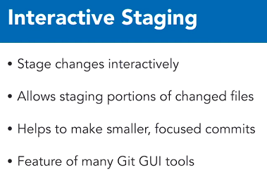
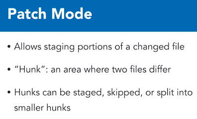
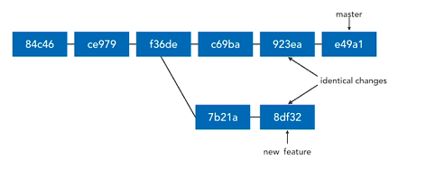
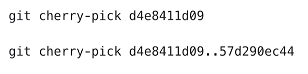
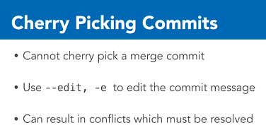
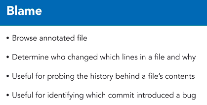
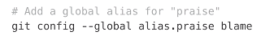
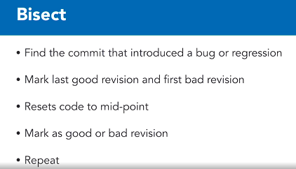

# Advanced Git

## Force Pushing

> This is done only when your remote repository is really messed up, and the only/easiest way to rectify it is to destroy it, and overwrite it with your local copy.

`git push -f {remote} {branch}`

OR use `git push --force`

* Use with caution!
* Always let your collaborators know about this!!!
* This will destroy the remote's history, and any commits you haven't synced with!

## Identify Merged Branches

> To get a list of branches already merged into your current branch:

`git branch --merged`

> To get branches whose commits haven't been merged into the current branch:

`git branch --no-merged`

> To find out the above, but on remote, just add the -r switch:

`git branch -r --merged`

## Delete Branches

> Delete a local branch, only if all its commits that have been merged into the current branch.

`git branch -d new_feature`

> Delete a remote branch:

`git push --delete {remote} {branch_name}` //Git version 1.7+

`git push -d {remote} {branch_name}` //Git version 2.8+

## Remove Stale Branches

* A `stale branch` is a branch whose tracking branch is locally available, but the corresponding remote branch is unavailable.
* Deleting a remote from a local repo, does not result in a stale branch -- as the tracking branch is also deleted.
* This will happen when someone else deletes a branch on the repo, which you have a tracking branch of.

`git remote prune origin --dry-run`

`git remote prune origin`

If you want to **fetch** *and* **prune** at the same time:

`git fetch --prune`

You can make pruning the default fetch behaviour by editing the config (not recommended):

`git config --global fetch.prune true`

**Don't use `git prune` which is *very* different to `git remote prune`**.

## Interactive Staging

You run it using: `git add -i`

You run it by selecting option `5` in interactive mode.

## Cherry-Picking Commits

* The second command shows cherry-picking a range of commits.

## Diff Patches

The idea is to just package up changes in a file, and share it via e-mail, thumbdrive, etc.

`git diff {from-commit-sha} {to-commit-sha} > output.diff`

To apply a diff:

`git apply {file}.diff`

## Blame

**To use it:**

`git blame -w filename.txt`

(we don't want whitespace changes)

Another option is to blame a file at a specific revision:
`git blame {SHA} -- filename.txt`

Some people use aliases for `blame`, due to the negative connotation.
Often they use `praise` instead.

## Bisect

* `git bisect start` will start a bisect session.
* `git bisect good` and `bad` accepts a SHA/branch/commit as points to mark and bisect.
* Whenever you want to stop, use `git bisect reset` to bring your workspace back to normal.
* Typically you run a battery of tests in every bisect to determine if the revision is good or bad.

### Bisect Workflow

1. Start the bisect
2. Tell it where the first bad commit is (don't specify a SHA if you want to use the HEAD).
3. Tell it where the first good commit is.
4. It will now start bisecting, giving you a temp workspace of an inbetween commit.
5. Run all your tests.
6. Tell Git Bisect if the current commit is good or bad by running either `git bisect good` or `git bisect bad`.
7. When you finally get to the last commit in Bisect, and you run `git bisect bad`, it will mark the current commit as **bad**.
8. Run `git bisect reset` to exit.
9. If you look at the logs, Git Bisect will say which commit is bad!
