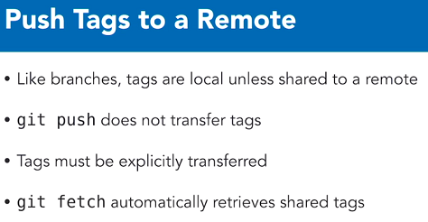
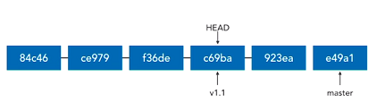
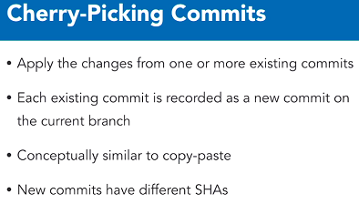
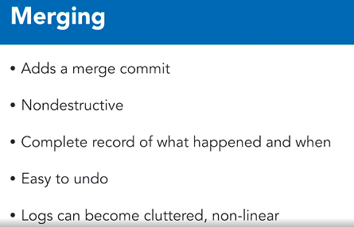
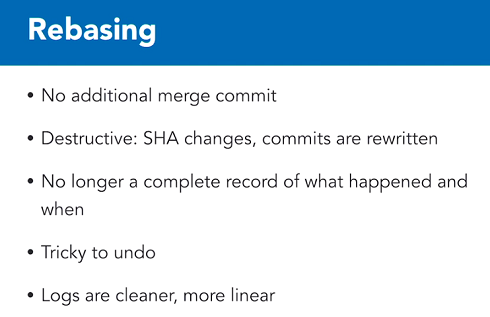
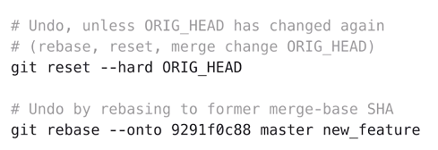

# Advanced Git

## Force Pushing

> This is done only when your remote repository is really messed up, and the only/easiest way to rectify it is to destroy it, and overwrite it with your local copy.

`git push -f {remote} {branch}`

OR use `git push --force`

* Use with caution!
* Always let your collaborators know about this!!!
* This will destroy the remote's history, and any commits you haven't synced with!


## Identify Merged Branches

> To get a list of branches already merged into your current branch:

`git branch --merged`


> To get branches whose commits haven't been merged into the current branch:

`git branch --no-merged`


> To find out the above, but on remote, just add the -r switch:

`git branch -r --merged`


## Delete Branches

> Delete a local branch, only if all its commits that have been merged into the current branch.

`git branch -d new_feature`


> Delete a remote branch:

`git push --delete {remote} {branch_name}` //Git version 1.7+

`git push -d {remote} {branch_name}` //Git version 2.8+


## Remove Stale Branches

* A `stale branch` is a branch whose tracking branch is locally available, but the corresponding remote branch is available.
* Deleting a remote from a local repo, does not result in a stale branch -- as the tracking branch is also deleted.
* This will happen when someone else deletes a branch on the repo, which you have a tracking branch of.

`git remote prune origin --dry-run`

`git remote prune origin`


If you want to **fetch** *and* **prune** at the same time:

`git fetch --prune`


You can make pruning the default fetch behaviour by editing the config (not recommended):

`git config --global fetch.prune true`


**Don't use `git prune` which is *very* different to `git remote prune`**.


## Tagging


* **To create a lightweight tag**:

`git tag {tag_name} {SHA_commit_val}`

e.g.

`git tag issue136 755da716e7`


* **To create an annotated tag (which is the most common, and it simply includes a message):**

`git tag -a {tag_name} -m "message" {SHA_commit_val}`

e.g.

`git tag -a v1.1 -m "Version 1.0" dd5c2ea3a0`


> If you ommit the commit value, Git would use the current HEAD value.


### Listing Tags

* Remember, tags essentially mark convenient/important points for future reference.

* **Synonymous ways to list tags:**

```shell
git tag
git tag --list
git tag -l
```

* **Filtering tags:**

`git tag -l "name with wildcard"`


* **List tags with *annotations***:

`git tag -l -n`

* **Work with tags (like SHAs)**:

`git show {tag_name}`

`git diff {tag_name_1}..{tag_name_2}`


### Delete Tags

`git tag --delete {tag_name}`

`git tag -d {tag_name}`


**To delete remote tags:**

`git push --delete {remote} {tag_name}`

`git push -d {remote} {tag_name}`

e.g.

`git push -d origin v1.1`


### Pushing Tags




**To push a tag:**

`git push {remote} {tag_name}`


**To push *all* tags:**

`git push {remote} --tags`


### Checking out tags

* **Best practice** is to checkout a tag to a ***new* branch**.
* If you checkout a commmit, you can get back to your previous position with `git checkout {branch_name}` (your HEAD has moved, so you can't use reset).


The reason why you don't want to directly checkout a tag, is because when you do check it out, your **HEAD ends up pointing to the tag**.
This means if you make a new commit, Git is forced to make a *new, unnamed* branch.
This puts you into a **detached head state**.




**If you end up in this situation, there are two ways to fix it:**

```shell
# Tag the commit (HEAD detached):
git tag temp

# Create a branch and reattach HEAD:
git checkout -b temp_branch
```


## Interactive Staging


You run it using: `git add -i`


You run it by selecting option `5` in interactive mode.


## Cherry-Picking Commits




* The second command shows cherry-picking a range of commits.


## Diff Patches

The idea is to just package up changes in a file, and share it via e-mail, thumbdrive, etc.

`git diff {from-commit-sha} {to-commit-sha} > output.diff`

To apply a diff:

`git apply {file}.diff`


## Rebasing

An intermediate technique for managing and incorporating changes between two branches.


**Before Rebase**


**After Rebase**


**Note:** Because the commits in the new_feature branch will now have different parents, their SHA value will **change**. Same changeset, but different SHA!

> What happens is that git collects all the commits in the new_feature branch and rewinds back to the point it branched off the master branch.
> It then merges the commits from the master branch in to the new_feature branch.
> Finally, the collected commits are replayed on to the new_feature branch.


### To Perform a Rebase

```shell
# Rebase current branch to tip of master
git rebase master

# git rebase master, means use the tip of branch 'master' as my new base.

# If you want to specify which branch should be rebased:
git rebase master new_feature

# This means, change the base of 'new_feature' to the tip of 'master'

# Useful command to return a commit where a topic branch diverges
git merge-base master new_feature

# To do a pull which rebases your branch:
git pull --rebase
```

### When Should You Merge vs. Rebase







### Undoing a Rebase

* Remember a rebase is destructive!
* You can undo a **simple** rebase, you can undo it.



* The ORIG_HEAD is a temporary variable Git keeps when doing operations like rebase. You can access it provided it's still there and not overwritten. So provided you haven't done another rebase, you can run the above command.
* Keep in mind, the second option is another **destructive** process as we're performing another rebase.


## Blame


**To use it:**

`git blame -w filename.txt`

(we don't want whitespace changes)

Another option is to blame a file at a specific revision:
`git blame {SHA} -- filename.txt`


Some people use aliases for `blame`, due to the negative connotation.
Often they use `praise` instead.


## Bisect


* `git bisect start` will start a bisect session.
* `git bisect good` and `bad` accepts a SHA/branch/commit as points to mark and bisect.
* Whenever you want to stop, use `git bisect reset` to bring your workspace back to normal.
* Typically you run a battery of tests in every bisect to determine if the revision is good or bad.


### Bisect Workflow

1. Start the bisect
2. Tell it where the first bad commit is (don't specify a SHA if you want to use the HEAD).
3. Tell it where the first good commit is.
4. It will now start bisecting, giving you a temp workspace of an inbetween commit.
5. Run all your tests.
6. Tell Git Bisect if the current commit is good or bad by running either `git bisect good` or `git bisect bad`.
7. When you finally get to the last commit in Bisect, and you run `git bisect bad`, it will mark the current commit as **bad**.
8. Run `git bisect reset` to exit.
9. If you look at the logs, Git Bisect will say which commit is bad!
