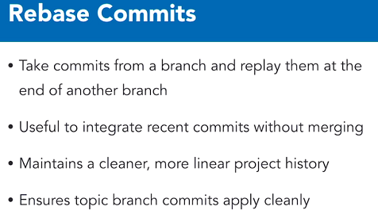
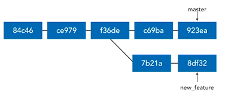
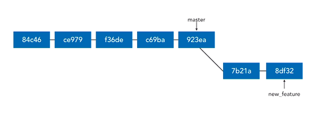
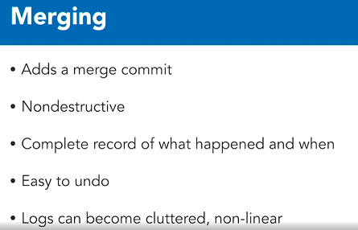
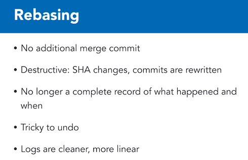
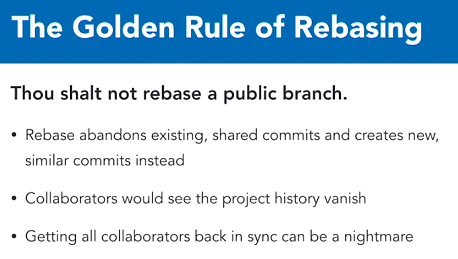
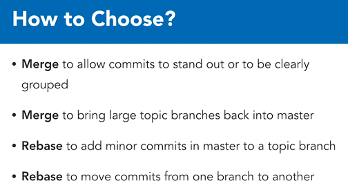
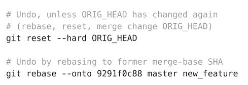

# Rebasing

An intermediate technique for managing and incorporating changes between two branches.



**Before Rebase**



**After Rebase**



**Note:** Because the commits in the new_feature branch will now have different parents, their SHA value will **change**. Same changeset, but different SHA!

> What happens is that git collects all the commits in the new_feature branch and rewinds back to the point it branched off the master branch.
> It then merges the commits from the master branch in to the new_feature branch.
> Finally, the collected commits are replayed on to the new_feature branch.


## To Perform a Rebase

```shell
# Rebase current branch to tip of master
git rebase master

# git rebase master, means use the tip of branch 'master' as my new base.

# If you want to specify which branch should be rebased:
git rebase master new_feature

# This means, change the base of 'new_feature' to the tip of 'master'

# Useful command to return a commit where a topic branch diverges
git merge-base master new_feature

# To do a pull which rebases your branch:
git pull --rebase
```

## When Should You Merge vs. Rebase










## Undoing a Rebase

* Remember a rebase is destructive!
* You can undo a **simple** rebase, you can undo it.



* The ORIG_HEAD is a temporary variable Git keeps when doing operations like rebase. You can access it provided it's still there and not overwritten. So provided you haven't done another rebase, you can run the above command.
* Keep in mind, the second option is another **destructive** process as we're performing another rebase.
