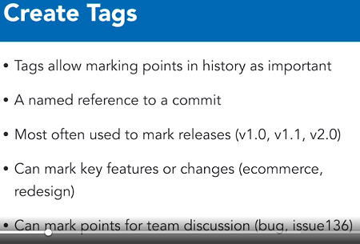
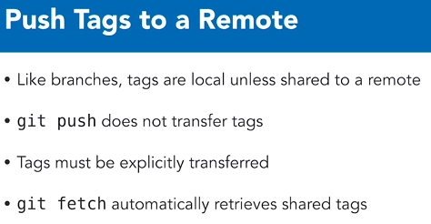
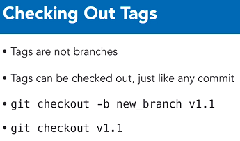
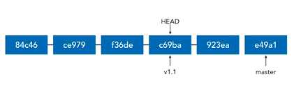
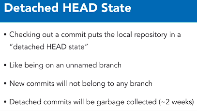
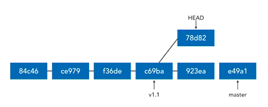

# Tagging



* **To create a lightweight tag**:

`git tag {tag_name} {SHA_commit_val}`

e.g.

`git tag issue136 755da716e7`


* **To create an annotated tag (which is the most common, and it simply includes a message):**

`git tag -a {tag_name} -m "message" {SHA_commit_val}`

e.g.

`git tag -a v1.1 -m "Version 1.0" dd5c2ea3a0`


> If you ommit the commit value, Git would use the current HEAD value.


## Listing Tags

* Remember, tags essentially mark convenient/important points for future reference.

* **Synonymous ways to list tags:**

```shell
git tag
git tag --list
git tag -l
```

* **Filtering tags:**

`git tag -l "name with wildcard"`


* **List tags with *annotations***:

`git tag -l -n`

* **Work with tags (like SHAs)**:

`git show {tag_name}`

`git diff {tag_name_1}..{tag_name_2}`


### Delete Tags

`git tag --delete {tag_name}`

`git tag -d {tag_name}`


**To delete remote tags:**

`git push --delete {remote} {tag_name}`

`git push -d {remote} {tag_name}`

e.g.

`git push -d origin v1.1`


## Pushing Tags




**To push a tag:**

`git push {remote} {tag_name}`


**To push *all* tags:**

`git push {remote} --tags`


## Checking out tags

* **Best practice** is to checkout a tag to a ***new* branch**.
* If you checkout a commmit, you can get back to your previous position with `git checkout {branch_name}` (your HEAD has moved, so you can't use reset).



The reason why you don't want to directly checkout a tag, is because when you do check it out, your **HEAD ends up pointing to the tag**.
This means if you make a new commit, Git is forced to make a *new, unnamed* branch.
This puts you into a **detached head state**.








**If you end up in this situation, there are two ways to fix it:**

```shell
# Tag the commit (HEAD detached):
git tag temp

# Create a branch and reattach HEAD:
git checkout -b temp_branch
```