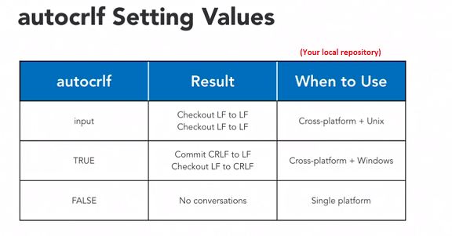
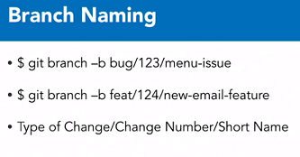
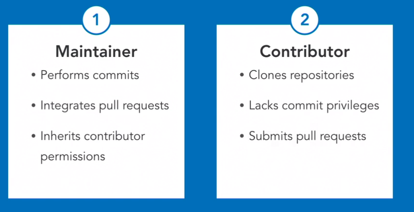
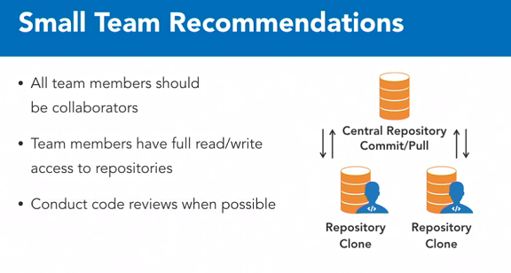
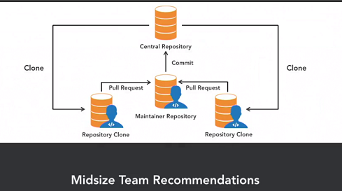
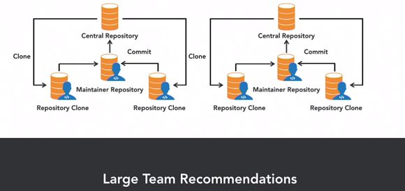
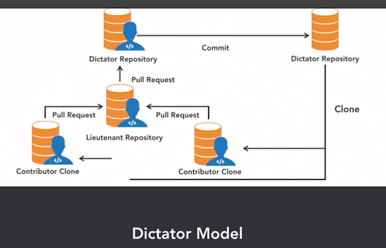
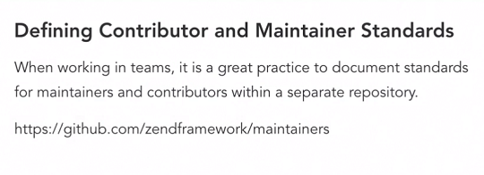

# Git For Teams

## Common Pitfalls

### Scenario - Untracked Pulls

* _User 1_ modifies _file A_, adds, commits and pushes it to the remote.
* _User 2_ modifies _file A_, *does not add* it, then pulls from the remote.

> Git will now warn you that you have untracked changes which will be overwritten.

* You shouldn't **pull** at _any_ time. You can do a `git reset  --hard` to have a clean working directory to pull,
or you can commit all your changes before doing the pull.

> If you want to both add and commit, use `git commit -am "Commit message"`.

* To continue the above scenario, say _User 2_ commits his changes. When he pulls, he will get a **merge conflict**.
* Git *will add metadata* to the conflicting file. First **remove this metadata**, then proceed with resolving the conflict.


### Scenario - Force Push

* _User 2_ creates a new file, adds, commits and pushes it to remote.
* _User 1_ makes a change to an existing file. He adds, commits and attempts to push.

> Git will warn you that you **cannot push because your local repository is not in sync with the remote**.

* If _User 1_ is stubborn, he forces a push using `git push origin master`.

> ***This is terrible practice!*** All of _User 2_'s changes will be lost in the remote! The --force flag should be avoided for the main repository!


## Best Practices

### Commit early, commit often. 

* Small, frequent commits. 
* **Commit at the implementation of each feature.**

### Pull frequently

* This reduces the chances of a merge conflict.

### Use .gitignore 

* To prevent tracking of unimportant files (e.g. compiled files, IDE files). 
* Git ignore files are typically placed within the root of the repository. 
* Each line in a .gitignore file represents a file (or directory) pattern. 
* If you want to exclude directories but include files with the same name, include the forward slash  e.g. `bin/`. 
* If you use a double asterisk, it means exclude even if it is in a subdirectory.

### Standardize line endings for cross-platform development

* It's best to standardize line endings

> `git config core.autocrlf <value>`. 
This will control how line endings are replaced when you add/checkout a file.



### Use a naming convention for branches



To see all available branches:
> `git branch -a`

### Write Descriptive Commit Messages

* The first step is to configure git to use an editor for messages:

> git config --global core.editor "/usr/bin/gedit (path to your editor)"

* Setup a commit message template:

> git config commit.template <"path to message template">

Example template:
```
# Place a subject above the body, limit to 50 chars

# Specify the body of the commit one line below the subject wrapping at
# 70 characters to keep things neatly organized.  Here you should explain
# why the commit was created.
# You can use multiple paragraphs and other formatting to describe the
# commit.  Add details as necessary until you have provided enough info
# about the commit.
#    - Bullets can be added
#    - But should be persistent
    
# Additionally, work items can be tracked using their id numbers.
# Work Items Resolved: 557, 188, 122
```


## Team Composition and Roles

There are two primary roles:



* A contributor can only clone a repository and commit to his own local repository.
* A contributor requests a maintainer to pull their commited feature to the remote repository.

### Team Structures

* **Small**: 1 to 4 members
* **Medium**: 5 to 9 members
* **Large**: 10+ members



For small teams, everyone is contributor/maintainer.



At least 2-3 maintainers to merge contributions. These should be the most senior members of the team, who reviews code.



Many integrators, assigned to each sub-project within an overarching project.

Alternatively, there is the dictator model where another layer of approval is needed before merging sub-repositories into a single main repository (not frequently used, but used for Linux project):




**Standards**



