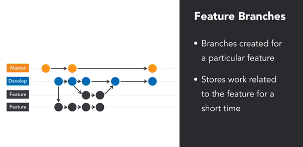

# Git For Teams - Teaming with Remotes

## Remote Platform Selection


## Installing GitLab

**Why GitLab?** You're able to install an on-premise version of it for free.


Steps:

```bash
sudo apt-get update

# Pre-reqs for GitLab Self-Hosted
sudo apt-get install -y curl openssh-server ca-certificates

# Download
curl -sS https://packages.gitlab.com/install/repositories/gitlab/gitlab-ce/script.deb.sh | sudo bash

# Specify the URL to access GitLab and install GitLab CE
sudo EXTERNAL_URL=http://localhost:80 apt-get install gitlab-ce
```

* Visit http://localhost:80
* You will be asked to create a password.
* Login as "root" with your new password.
* **Merge Requests** are like GitHub's **Pull Request**, which basically allows a _maintainer_ to merge a _contributor's_ request to commit.


* Giving a user the role of "Developer" gives them push/commit privileges on branches that are not protected.
* Maintainers can do pushes onto protected branches. They should be allowed to *push* and *merge*.


## Branching Strategies


* Long running branches always remain open and store the history of the project.
* A **trunk** or **master** branch stores the _current release_ of the project.
* The **Develop** branch will have ongoing feature development.



* Short lived, closed once completed and merged into Develop branch.


* Branch off the master, which contains the current release, fix the issue and merge into the Develop branches.


## Workflows


There are two commonly used workflows:

1. Trunk-based Workflow (quite new)
2. Git Flow


### Trunk-based Workflow


* In this strategy, Trunk is the *only* **long-lived branch** for pulling, merging and syncing.
* Some teams allow branching for *release branches* or other **short-lived** branches used for code reviews.
* Feature branches and other simple branches is not allowed.
* The selling point is that reduces inevitable problems when merging a long lived branch (breaking the build, merge conflicts).
* Google, Amazon and Facebook use this successfully.


* This is not feasible without TDD/CI/CD - the trunk must be working, nearly release ready and the CD platform must be able to roll-back failed builds or tests. Otherwise your master branch will have unstable code.


### Git flow


* Git flow revolves around two long lived branched: Master and Develop.
* The Master branch is tightly controlled.
* The Develop branch is used by everyone to build feature branches.


* When enough features are added to Develop to warrant a release, a new Release branch is created.


* Bug fixes can be implemented into **Release** prior to its actual release. These fixes are commited to the Release branch and eventually merged with the Develop branch.

* Release branch is merged with Master, once it's in production.

* Finally, develop branch is synced with the release.

* Git flow allows branches off Master to be created for hot fixes.

* Direct modification of Master and Develop aren't allows by contributors.


* Git flow basically supports experimentation better.

* Git flow is better for Agile teams that plan around iterations and releases.


