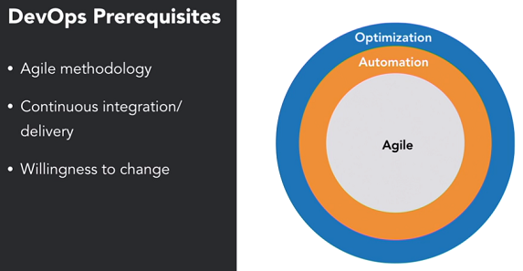

# Git For Teams - Continuous Integration / Continuous Delivery

## Continuous Integration


* The alternative to CI is big bang integration, which is common towards the end of development where massive amounts of code needs to be integrated.
This leads inevitable merging problems such as conflicts and broken builds. By integrating early and often, we can mitigate this.

* Broken builds are a stop the world event, and everyone must work to resolve them. Automated quality checking can mitigate this, and it is important to ensure that code in the repository is working.

* **Massive integrations are the enemy!**

* **Every commit must pass QA!**


* Developers **push** their changes to the **remote repository**. 
* A CI tool monitors the repository for changes - when a change is detected, it compiles the code on a **build server**, which executes **automated tests** on it. 
* If the build or the tests **fail**, the team is **notified**.
* CI can be extended to CD (Continuous Delivery), which automatically deploys successful builds to the DEV/TEST environments.


### CI Tools


### Installing Gitlab Runner

Pre-reqs:
1. Java 8
2. Maven

Go to:

https://docs.gitlab.com/runner/install/linux-manually.html

Download the appropriate file by copy pasting the shell command.


**Start and Register the Runner to work with the GitLab Repo Manager**


> We create a `.gitlab-ci.yml` file that contains the CI pipeline instructions, and place it in the repository root.

```yaml
build:
  script:
    - mvn compile

test:
  script:
    - mvn test
  artifacts:
    paths:
      - target/surefire-reports/TEST-com.simple.SampleTest.xml

quality:
  script:
    - mvn findbugs:check

quality-report:
  script:
    - mvn site
  artifacts:
    paths:
      - target/site/
```

## DevOps

* Prior to DevOps, standardard practices completely separated those who deployed and operated the software, from those who developed it. E.g. Different teams, divisions or even geographic locations.


* DevOps moved operational and deployment teams to within the development unit, so they no longer work in silos and work together to deliver software.


* DevOps heavily uses tooling to automate everything, to standardize all processes.
* This is about delivering high quality software rapidly, and being response.
* Agile is important.




**Establishing DevOps**

