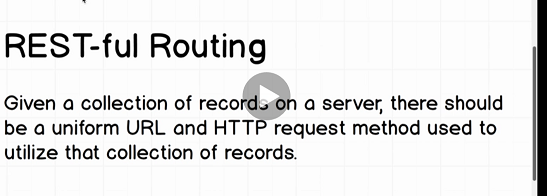
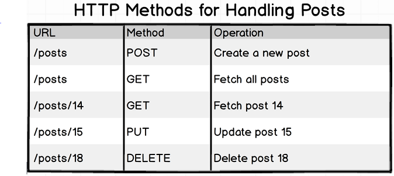
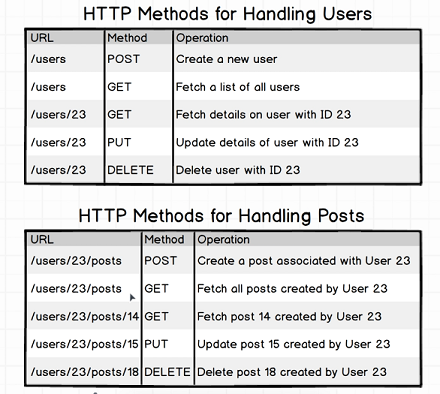
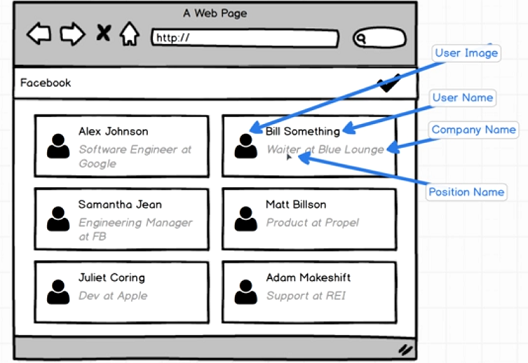
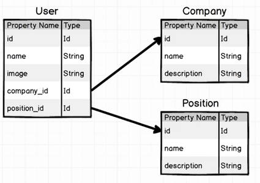
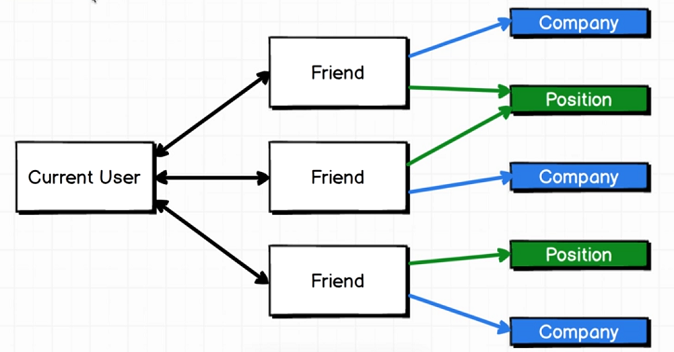
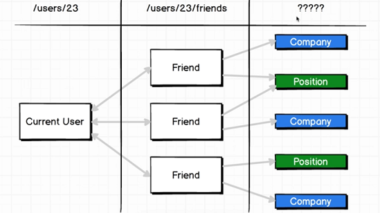
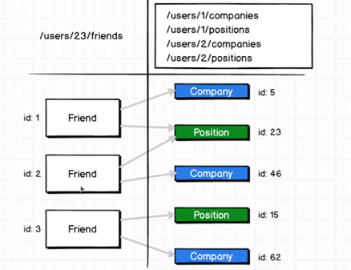
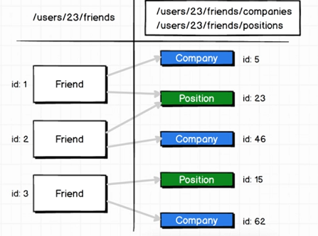
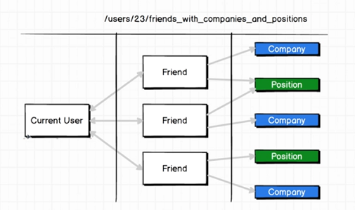

# Why GraphQL

To understand why, we need to know the current popular method, RESTful routing.

## RESTful Basics

### Basic manipulation of records of a single entity

### Manipulating associated entities

## Shortcomings of REST

### Deeply nested entities

#### Example UI

#### Example ER

#### Example Relationships

### How do you find the companies and positions of a user's friends?

What kind of RESTful URL look like to answer the above question?

#### Option 1

1. Get the list of user's friends at /user/23/friends
2. Make a separate query for each friend, to get all their details - which will include the `company` and `position`

**PROBLEM:** It can be a lot of HTTP requests! This can be very expensive!

**BENEFIT**: Simple and intuitive, obeys RESTful conventions.

#### Option 2

1. _Without violating RESTful conventions_, Expose a URL that answers that specific question - it will be a URL with deeply nested entities

**PROBLEM:** You have to program that endpoint to answer that very specific question. If there are many questions that involve complex relationships,
that would mean an explosion of endpoints you have to manually code! The URL will also become very long!

#### Option 3

Break RESTful conventions, expose an endpoint that answers that specific question.

**PROBLEM:** You've broken REST conventions, and still have the problem of option 2.

### Shortcoming of ALL RESTful endpoints

You generally end up OVER-serving the data you send to the client.
There's no way to only get the specific data you need.

In the example above, you just care about at most 3 fields - but you will probably get a tonne of fields related to users, companies and positions!
