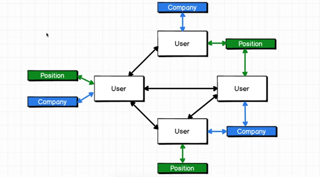

# What is GraphQL

To recap, the drawbacks of REST is:

1. We tend to over-fetch data.
2. We can end up making many different HTTP requests.
3. URL design becomes hard for heavily nested data.

**GraphQL** allows you to solve the above issues more easily.

## Example

The example covered previously, can be expressed as a graph:

We have to traverse the graph in order to answer the query, what a GraphQL query would like is below:

## Setup notes with Express

- To setup a GraphQL server, we need an HTTP server with a GraphQL module.
- For NodeJS, the core elements of this server is:

1. graphql
2. graphql-express (Express middleware that you wire up to a route).
3. express

- When creating the middleware for GraphQL, you need to pass in a schema.
- For development purposes, you can enable a UI for writing GraphQL queries by passing in `graphiql: true`
- A GraphQL schema defines the entity data types and their relationships.
- _GraphQL queries look similar to Javascript, the are **not**._
- GraphQL `resolve` functions must return Javascript objects, the schema validation is handled by GraphQL.
- If you return a `Promise` in `resolve`, it will only return once the promise is resolved.
