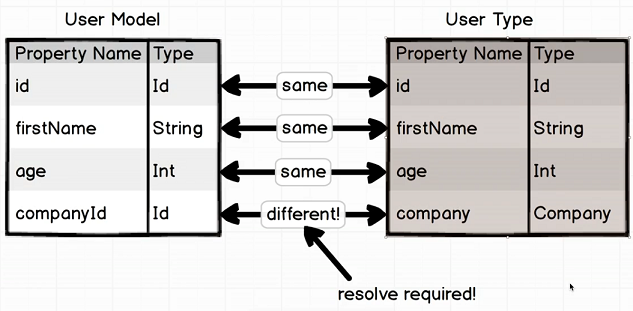
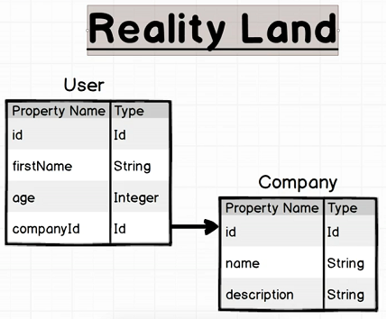
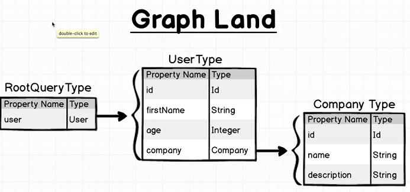
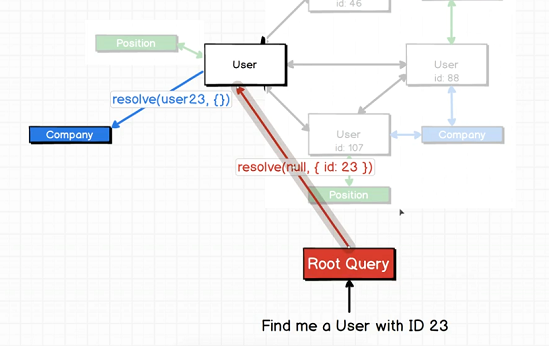
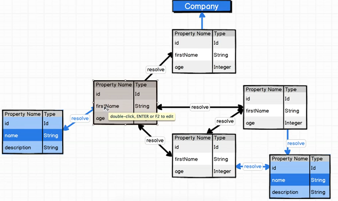
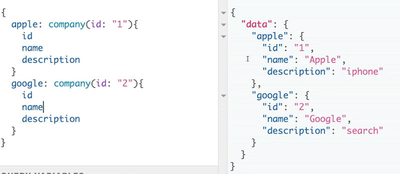
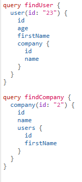
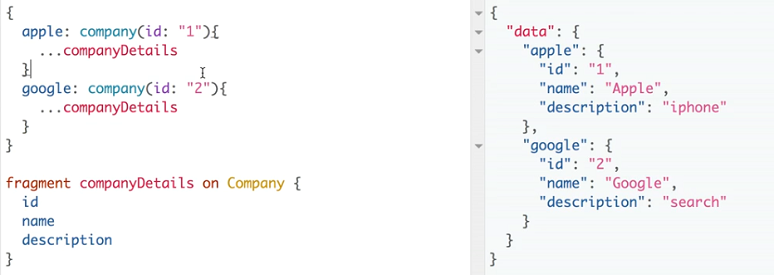
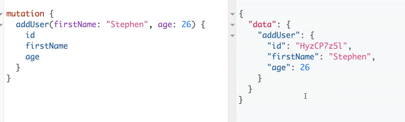

# Basic Querying Notes

- To link two entities, you need to include a `resolve` function in the field of the entity.
- To resolve the relationship between User and Company, in the `resolve` function, the current `User` object will be passed into the `parentValue` argument. Use the `companyId` field of the actual user to find the company.

## Overview

- Your real data may exist in a DB or REST API or anything else.
- The way GraphQL models your data _will be different_.
- In the example project, the following diagrams depict the differences:

- We enter to the graph via the RootQuery.
- The graph shown above is uni-directional.

> You can think of the `resolve` function representing the **_edges_** between _nodes_ in the _graph_.

## Dealing with circular references

- When two nodes refer to each other, you will have a circular reference
- A circular reference can't compile, because one relies on a reference that hasn't been created yet.

> To fix this, make `fields` a **closure**. The function will be compiled, but its internal contents won't be executed till required.

> Note: With cyclic relationships, your query can recurse to any depth you like (to infinity).

## Graphiql

In order to query the same entity multiple times, you need to wrap it in a different key:

You can name your queries, using the following syntax

## Query Fragments

They are basically reuseable lists of properties from a fragment:

## Mutations

- To perform mutations on data, you need to create a separate GraphQLObjectType, whose _fields_ are like methods that perform mutations.
- The actual mutation logic is done in the `resolve` function.
- To perform validation, you need to wrap the types with one of GraphQL's basic object validations such as `new GraphQLNonNull`.

A mutation query in Graphiql:

