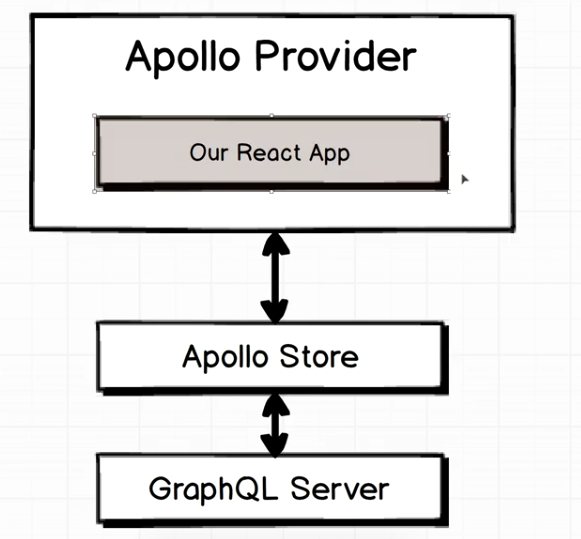
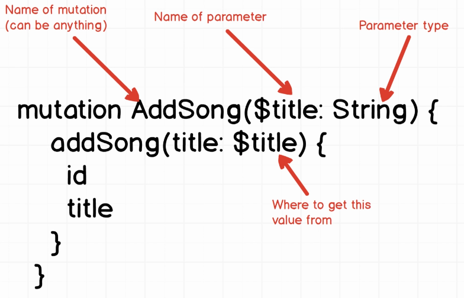
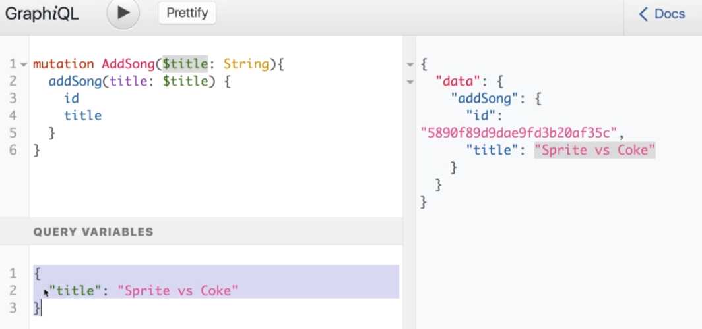

# Client Side GraphQL using Apollo



- **Apollo Store**: Communicates directly with the GraphQL server and stores data from it. It is a client-side repository of all the data from the GraphQL server. It is client-side framework _agonistic_.
- **Apollo Provider**: This is the integration layer between the **Apollo Store** and the **React App**. **ApolloProvider** requires the **ApolloClient** to work, **ApolloClient** is _platform agnostic_ unlick the provider.

> The vast amount of setup is to do with the **Provider** - the **Store** requires minimal work beyond the initial setup.

## Steps for using GraphQL Queries

1. Write the query using graphiql.
2. Write the query in the web app.
3. Bond the query with the React component.
4. Access the data.

## Writing GraphQL Queries Client-side

### Writing the query

- We need to import a library called `graphql-tag`.
- We write our queries using template strings, and graphql-tag parses them.

```javascript
import gql from "graphql-tag";

const query = gql`
  {
    songs {
      title
    }
  }
`;
```

### Bonding the query with the component

#### Old way

- import `graphql` from `apollo-react`
- `graphql` is a HOF, that takes in the query, and returns a function that accepts a component: `graphql(query)(SongListComponent)`
- The graphql data is placed in the props object.

#### New way - hooks

```javascript
import { useQuery } from "@apollo/react-hooks";
function SongListComponent() {
  const { loading, error, data } = useQuery(GET_DOGS);
  //...
}
```

#### Lifecycle of query and component


To use the query data:

```javascript
import gql from "graphql-tag";
import { useQuery } from "@apollo/react-hooks";

const GET_DOGS = gql`
  {
    dogs {
      id
      breed
    }
  }
`;

function Dogs({ onDogSelected }) {
  const { loading, error, data } = useQuery(GET_DOGS);

  if (loading) return "Loading...";
  if (error) return `Error! ${error.message}`;

  return (
    <select name="dog" onChange={onDogSelected}>
      {data.dogs.map((dog) => (
        <option key={dog.id} value={dog.breed}>
          {dog.breed}
        </option>
      ))}
    </select>
  );
}
```

The above code:

- Shows `Loading...` while the query is still in flight.
- Only shows the query data **when `loading` is `false` and `error` is `undefined`**.
- **It is very important you check `loading` and `error` before accessing the data!**

## Using Mutations

Mutations typically need to accept variables, therefore when writing a mutation, we _need to add parameters_.



- Note that we give the mutation an identifying name, which is not tied to the backend server, and is only for own purpose.
- The muations accepts a parameter, which passes to the mutation defined by the GraphQL server.
- **The exclamation mark means that the parameter is required.**
- **These parameters are called `query variables` and can be seen in `graphiql`**



### Mutations client side

```javascript
import gql from "graphql-tag";
import { useMutation } from "@apollo/react-hooks";

const ADD_TODO = gql`
  mutation AddTodo($type: String!) {
    addTodo(type: $type) {
      id
      type
    }
  }
`;

function AddTodo() {
  let input;

  /*
  The useMutation hook does not automatically execute the mutation you pass it when the component renders. 
  Instead, it returns a tuple with a mutate function in its first position (which we assign to addTodo). 
  You then call the mutate function at any time to instruct Apollo Client to execute the mutation. 
  Below, we call addTodo when the user submits the form.

  In addition to a mutate function, the  hook returns an object that represents the current state of the mutation's execution. 
  The fields of this object (fully documented in the API reference) include booleans that indicate whether the mutate function has been called yet, 
  and whether the mutation's result is currently loading.
  */
  const [addTodo, { data }] = useMutation(ADD_TODO);

  return (
    <div>
      <form
        onSubmit={(e) => {
          e.preventDefault();
          // we pass in all the different query variables in an object under the key 'variables',
          // which is object of query variables to value
          addTodo({ variables: { type: input.value } });
          input.value = "";
        }}
      >
        <input
          ref={(node) => {
            input = node;
          }}
        />
        <button type="submit">Add Todo</button>
      </form>
    </div>
  );
}
```

### Re-fetching Queries

- When we perform a mutation, for example adding a song, we may refresh the app to show the new song list.
- However due to caching, Apollo wouldn't execute the query again.
- In order to re-execute queries upon a mutation, we need to pass in the queries that should be refetched as an option to the `useMutation` hook.
- Define all your queries in an external file, and pass them into the hook.

```javascript
import { SONG_QUERY, ADD_SONG } from "./queries";

function Component() {
  const [addSong, { data }] = useMutation(ADD_SONG, {
    refetchQueries: [{ query: SONG_QUERY }],
  });
  //...
}
```

The above approach allows us to refetch **any query** we have a reference to.

Another approach is the following:

```javascript
function DogPhoto({ breed }) {
  const { loading, error, data, refetch } = useQuery(GET_DOG_PHOTO, {
    variables: { breed },
    skip: !breed,
  });

  if (loading) return null;
  if (error) return `Error! ${error}`;

  return (
    <div>
      
      <button onClick={() => refetch()}>Refetch!</button>
    </div>
  );
}
```

## Interacting with the cache

Apollo Client has no idea what every row in a query is. This can be fixed by allowing it know what attribute is an identifier in the data.
Apollo uses caching to prevent unecessary fetches, by allowing to know which is the identifier, it will refetch queries whenever a mutation
takes place. This is an alternative to using `refetchQueries`, however there are cases where you'd prefer using that.

```javascript
const client = new ApolloClient({
  ...,
  cache: new InMemoryCache({
    ...,
    dataIdFromObject: object => object.id,
  }),
});
```

**Warning:**

> Warning: Each object type you cache should either always include an id field or never include an id field. InMemoryCache throws an error if it encounters an inconsistency in the presence or absence of this field for a particular type.

**Why should you use this?**

> If an object doesn't specify a \_\_typename or one of id or \_id, InMemoryCache falls back to using the object's path within its associated query (e.g., ROOT_QUERY.allPeople.0 for the first record returned for an allPeople root query). Avoid this fallback strategy whenever possible, because it scopes cached objects to individual queries. This means that if multiple queries all return the same object, each query inefficiently caches a separate instance of that object.

## Optimistic Updates

This is basically where we guess what an API response is for a mutation and continue updating the UI with that guess.

To enable an optimistic response, you pass in an object to the `optimisticResponse` field of the `mutate` function argument.

Example:

```javascript
mutate({
  variables: { commentId, commentContent },
  optimisticResponse: {
    __typename: "Mutation",
    updateComment: {
      id: commentId,
      __typename: "Comment",
      content: commentContent,
    },
  },
});
```
