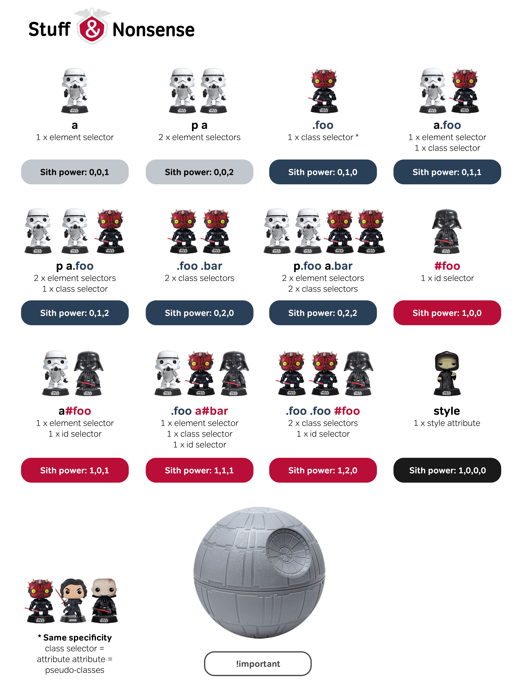

# CSS

## Ways of Inserting CSS

1. Inline - via "style" attribute of an element.
2. Internal - via a `<style>` block in the `<head>` section.
3. External - Define an external css file and link in the `<head>` section  using the following code: `<link rel="stylesheet" href="path/to/css.css">`

## Syntax

## Selectors

element .class #id

### Selector Specificity

