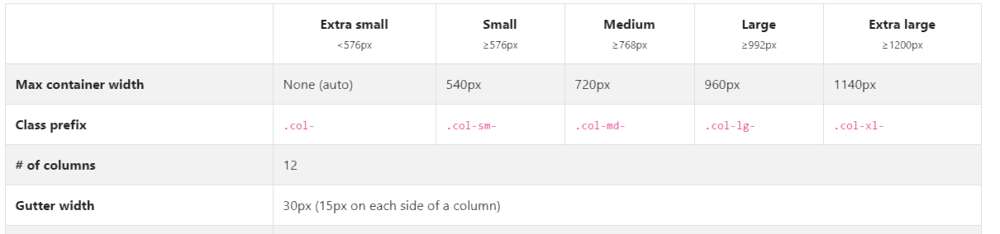

# Bootstrap

> See bootsnip.com for useful Bootstrap snippets.

It's a HTML, CSS and JS library for conveniently building pretty, responsive websites.
It makes the following easy:

- Responsive layouts
- Pre-styled elements

## Installation

### Method 1

- Include a `<link rel="stylesheet" href="cdn">` to the Bootstrap CDN. This is for the CSS.
- Include `<script src="cdn">` . This is for the Javascript libraries.

### Method 2

- Instead of pointing to a CDN, keep a code of the source locally and refer to that.

### Which is better?

Method 1 is better, as the CDN ensures it will reach the user the quickest **and takes advantage of broswer caching**.

## Navigation Bar

```html
<!--
Most of the navbar class name is a straight up copy of the bootstrap documentation
Note how we set colours:
- There are bunch of colours provided by bootstrap such as "warning", "primary", "danger", etc.
- By combining those words with something like "bg-", we can set colours.
-->
<nav class="navbar navbar-expand-lg navbar-dark bg-dark">
  <a class="navbar-brand" href="">tindog</a>

  <!--
In order to display The navbar links as a hamburger menu when on smaller screens, we use this 
button component. The "data-target" attriibute points to the ID of an element we want to put into
a menu.
NOTE: You need JQuery for this to work!
-->
  <button
    class="navbar-toggler"
    type="button"
    data-toggle="collapse"
    data-target="#navbarSupportedContent"
    aria-controls="navbarSupportedContent"
    aria-expanded="false"
    aria-label="Toggle navigation"
  >
    <span class="navbar-toggler-icon"></span>
  </button>

  <div class="collapse navbar-collapse" id="navbarSupportedContent">
    <!--
In order to maintain a margin between "tindog" and the navigation links, we use the Bootstrap
class "ml-auto". The "auto" part means it will by default put everything on the extreme right.

If you want, you can add a "fixed-top" class to make sure it stays on the top when you scroll.
-->
    <ul class="navbar-nav ml-auto">
      <li class="nav-item">
        <a class="nav-link" href="">Contact</a>
      </li>
      <li class="nav-item">
        <a class="nav-link" href="">Pricing</a>
      </li>
      <li class="nav-item">
        <a class="nav-link" href="">Download</a>
      </li>
    </ul>
  </div>
</nav>
```

## Grid Layout

- The Bootstrap Grid is divided into `row` and `col` classes.
- A `col` class must be inside a row.
- A grid consists of 12 columns - you specify how many columns should be taken.
- Below is an example of a _fixed_ column specification - take up 50% of screen, by taking up 6 columns.

```html
<div class="row">
  <div class="col-6">Column takes 50% of screen</div>
</div>
```

> When no number is specified, all the columns will take up an equal width.

### Responsive Grid

- In order to set different column sizes for different screen sizes, you need to specify the device size with the `col-` class.
- If you only set one device size, it means that column size will apply for all devices starting from the specified device size (e.g. if you only specified `md`, smaller screens take up full column width, larger devices will also use the `md` size).



```html
<div class="row">
  <div class="col-md-6">
    Column takes 50% of screen on medium devices upwards
  </div>
  <div class="col-md-6">
    Column takes 50% of screen on medium devices upwardsn
  </div>
</div>
```

## Bootstrap Containers

- Containers allow you to center or pad out your container.
- Fluid containers always take up a 100% of the width regardless of how you change the screen size. Regular containers have a `max-width` which dynamically changes based on on screen size.

## Examples

The TinDog example project has sample implementations of the Bootstrap Carousel and Card Deck
