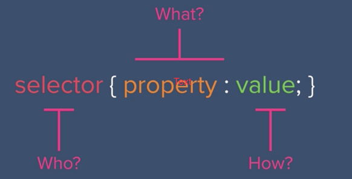
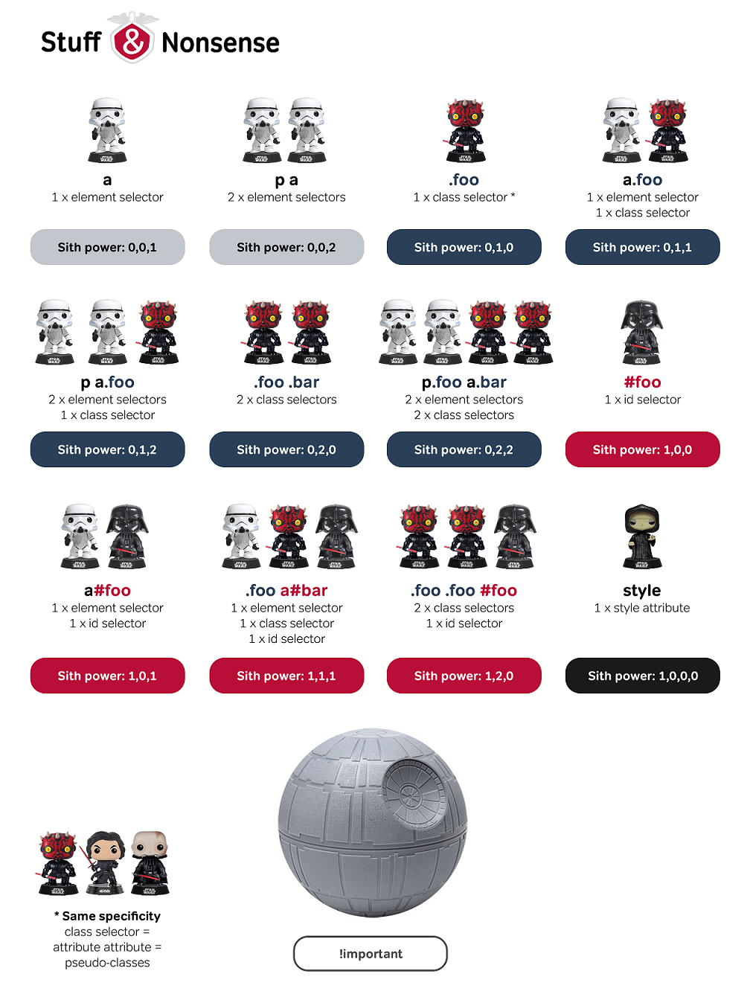
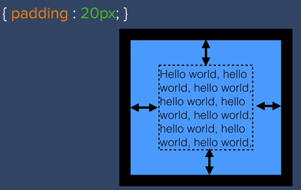
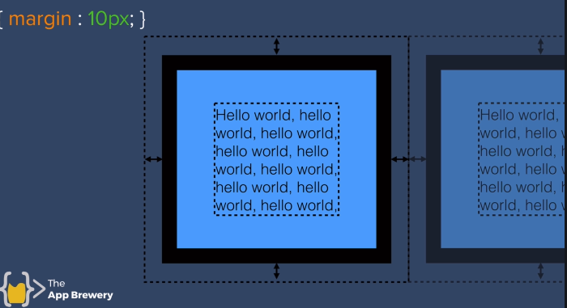
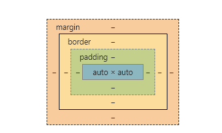
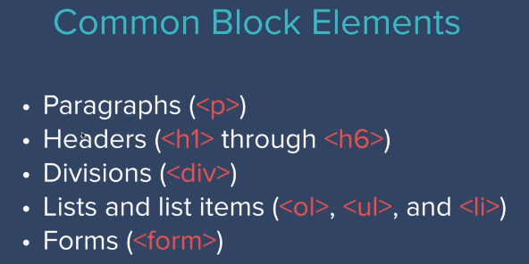
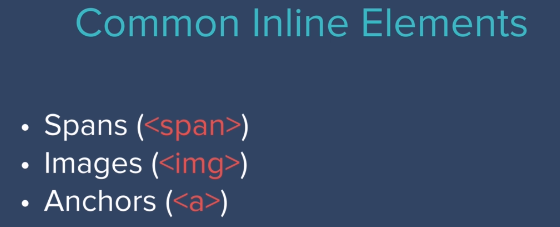
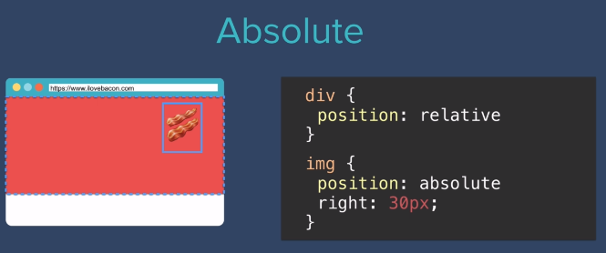
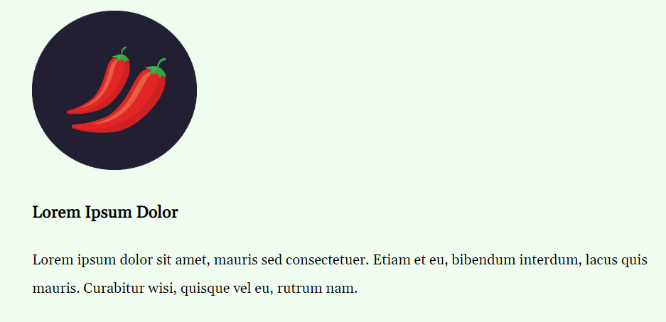

# CSS

## Ways of Inserting CSS

1. Inline - via "style" attribute of an element.
2. Internal - via a `<style>` block in the `<head>` section.
3. External - Define an external css file and link in the `<head>` section using the following code: `<link rel="stylesheet" href="path/to/css.css">`

The more "internal" the CSS is, the greater its specificity - therefore it overrides any other conflicting styling.

## Syntax



## Selectors

The syntax for selecting portions of the page to style:

- HTML Element: `elementName`
- Class Name: `.className`
- ID Name: `#id`

### Example

#### HTML

```html
<body>
  <h1 class="title">Calculus</h1>
  <h2 class="title">Fundamentals</h2>

  <p id="intro">Everyone hates calculus</p>
  <p class="content main">
    But it is one of the most important things you can learn in life
  </p>
</body>
```

#### CSS

```css
body {
  background-color: red;
}

.title {
  margin: 10px auto;
}

#id {
  background-color: black;
}

.content .main {
  margin: auto auto;
}
```

### Selector Specificity



### Pseudo-classes

- HTML elements can have different states - for example, when the mouse _hovers_ over an element.
- There are CSS classes that represent these states.
- They always start with a ":". E.g. `:hover`.

#### Example

The following will make all **image** elements have a background of gold on mouse hover.

```CSS
img:hover {
    background-color: gold;
}
```

## The Box Model of CSS

### Element Content Size

You can set the following properties to change the size of your element's content:

- width (e.g. `width: 100%`)
- height

They can be set using px or % (the latter is % of screen).

### Element Border Size

The following property **doesn't affect the size of the element's contents**:

- border (e.g. `border: solid`)
- border-width (e.g. `border-width: 50px`)

> If an element has a `width` and `height` of 20px, and a `border-width` of 50px, it's total area will be **600px**.

**By default, your element will take as much space to fit its \*contents**.

### Padding

This allows you to put padding between the **content** and the element's _border_.



### Margin

Creates a buffer between the **element** and any _neighbouring_ _elements_.



### The Box Model

This basically means you can affect, for every element, its: - content height and width - border - margin - padding

In the Chrome Developer Tools, every element has a diagram which displays the values of the element's **box model**. _These can be edited_.



## The CSS Display Property

_Remember that every HTML element comes with some default styling_.

```css
div {
  display: block;
}
```

## block

Element takes up the entire width of the page.



> With `block` elements, you can change its **width**, but it will not allow other elements to sit on the same line.

## inline

Element width only takes up as much space as needed. For example, you can use the `<span>` element to only style portions of sentences without messing the display of elements.



> With `inline` elements, you **_cannot_** change its **width**.

## inline-block

Allows you to share the same line of other elements (like `inline`), but you can _change_ its **width**!.

## None

Simply removes an element, as though it never existed.

## Position

### Rules of How Elements are Positioned by the Browser

1. Content is everything - this determines how large the element is.
2. Order comes from the code - the order of your elements in code, controls the order of rendering.
3. Children sit on parents - Child elements will be layered on **top** of its nearest parent. There is an `x, y` and `z` axis. The `z` index controls how elements sit on top of each other.

### Coordinates

There are four coordinate **properties** we can set:

- top
- right
- bottom
- left

### The Position Property Values

#### The "static" position value

- All HTML elements have this property value.
- It's simply the rules outlined above.

#### The "relative" position value

Position the element, **relative** to its **_static position_**.


In the above, the image is shifted `30px` to the `left` from its **original static position.**

There are two things you need to remember about the `relative` position value:

> 1. Changing the element's position, does **not** affect neighbouring elements.
> 2. When you specify a property like `top: 50px`, what it actually does is give a 50px margin between the element and its original position - **in other words, pushing it down by 50px.**

#### The "absolute" position value

The element is positioned, **relative to its nearest _parent_ element** that is `relative`.

> By default, the `body` element is `relative`, so if you give an `absolute` position to an element with no other parent elements which are `relative`, it will be positioned relative to the the `body` element.



In the above example, the `img` element is shifted `30px` away from the `right` of its **parent** `div`.

#### The "fixed" position value

If you set the `position` to `fixed`, the element will remain in its position, even if you scroll through the webpage.

## Centering Elements

1. Use `text-align: center;` in a parent container, to center everything that **does not have a width set.**
2. Use `margin: 0 auto` to center only the left and right, or set everything to auto for it to be completely centered.

## Fonts

When web designers first design a website, they start by choosing:

1. a color palette
2. a font scheme

There are two major **font families**:

1. Serif fonts - _these have little feet like hooks in the letters. E.g. Times New Roman_
2. Sans-serif fonts - _these don't have the hooks_.

Other families include:

- monospace: _each letter takes up the same space, typical for code editor fonts_
- cursive: _handwritten style_
- fantasy: _looks like a fantasy story book style_

By default, the browser renders:

1.  Serif - Times New Roman
2.  Sans-serif - Arial

To give the entire web page a particular font style:

```css
body {
  font-family: verdana, sans-serif;
}
```

### Web Safe Fonts

- Typically, you specify the font, but it only gets rendered if the user's system/browser supports the font.
- A set of fonts, where you have the maximum chance of a font getting rendered correctly.
- No font is 100% web safe.
- If you go to [CSS Font Stack](https://www.cssfontstack.com/), you will see the support for fonts. Nothing is 100%. But you can get some fallbacks for fonts, to render if the user doesn't have it.

> You should specify multiple fonts as fallback for maximum compatibility.

```css
body {
  font-family: Helvetica Neue, Helvetica, Arial, sans-serif;
}
```

The above means first try Helvetica Neue, if not, Helvetica, if not Arial, finally, whatever san-serif font available.

### Font Embedding

- If you want to ensure that a user will see your specified font, go to [Google Fonts](https://fonts.google.com)
- Click the "+" sign on any of the free fonts.
- Copy the generated `link` element and paste it into your HTML `head`.

### Font Sizing

If you want large fonts, you can simply use:

```css
h1 {
  font-size: 90px;
}
```

- **But the drawback of this is your font size is _fixed_**.
- The browser allows you to scale fonts to user preference (e.g. large for people who have trouble seeing)
- In order to have more dynamic fonts, use a percentage.
- A `100%` is equivalent to size `16px`. So to get the look of a `90px` size using a percentage, you do the following calculation:

> (90 \* 100) / 16 = 562.5%

Another way of getting dynamic font sizes, is to use a unit called `em`.

- `1em` = `16px` = `100%`

> So `90px` you would use `5.625em`

- `em` and `%` values are **inherited** by child elements.
- By inherited, this means that they are _added on top of the parent size_.
- If you want to ignore the inherited value, in **CSS3**, you use `rem` instead of `em` (r means root).

> There's an argument for using `em` and `%` for accessibility, but it may not be so important for that reason because most people use the zoom functionality rather than font size rendering of the browser.

> **`rem` is the recommended unit to use for sizing.**

## Float

How do we get the image to float to the left of the text below it?



Use:

```css
img {
  float: left;
}
```

> `float` is one of the most abused properties. It has a whole bunch of corner cases. Use it only for its intended purpose, which is wrapping text.

## Clear

This can be thought of being the anti-float, or to prevent wrapping. E.g. `clear: left;`
