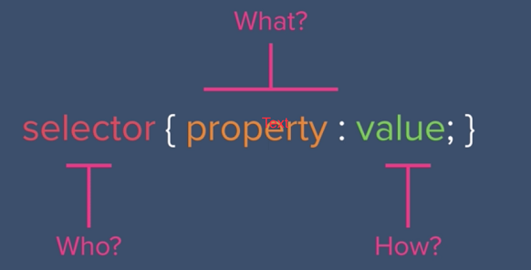
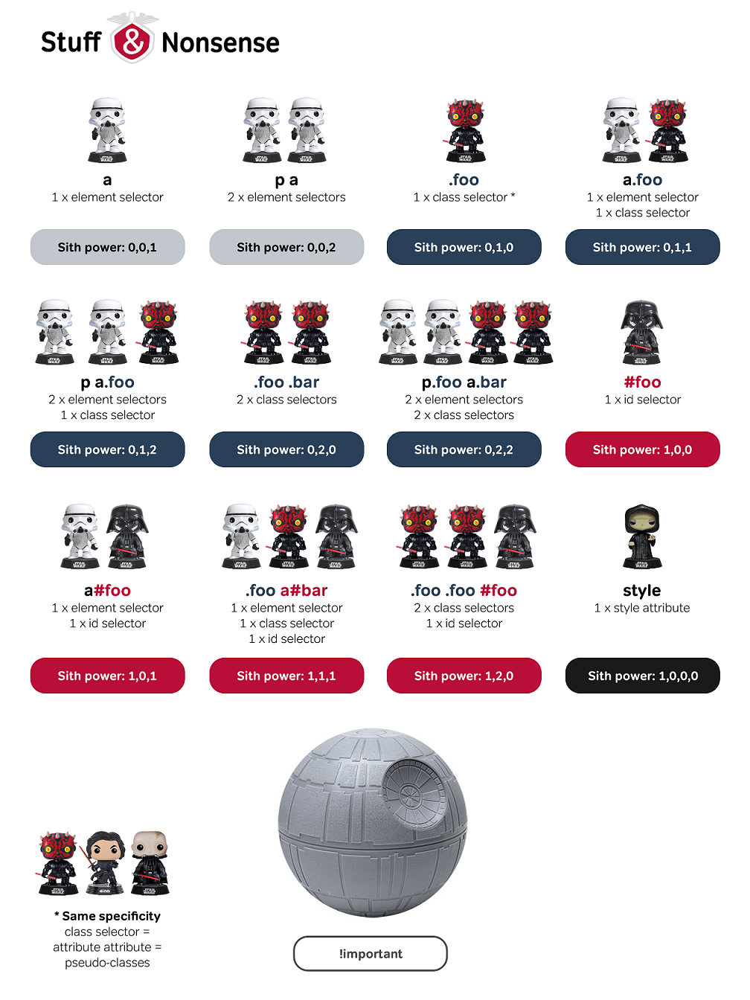
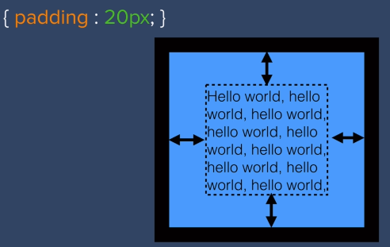
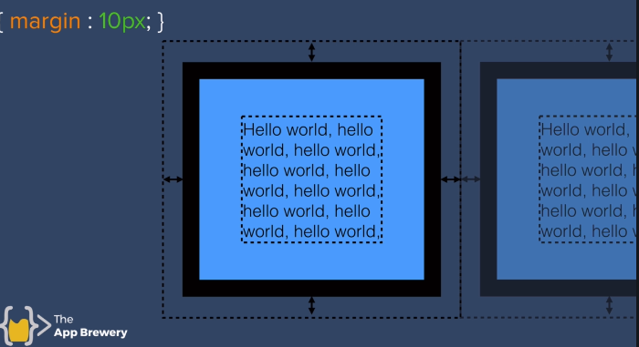
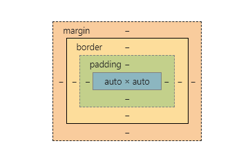
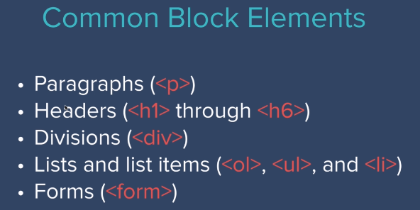
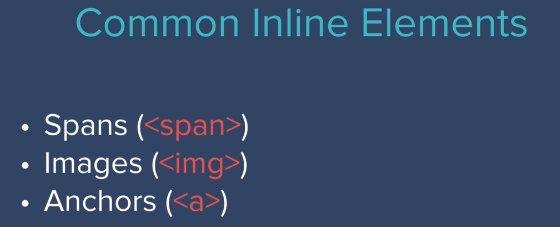

# CSS

## Ways of Inserting CSS

1. Inline - via "style" attribute of an element.
2. Internal - via a `<style>` block in the `<head>` section.
3. External - Define an external css file and link in the `<head>` section using the following code: `<link rel="stylesheet" href="path/to/css.css">`

The more "internal" the CSS is, the greater its specificity - therefore it overrides any other conflicting styling.

## Syntax



## Selectors

The syntax for selecting portions of the page to style:

- HTML Element: `elementName`
- Class Name: `.className`
- ID Name: `#id`

### Example

#### HTML

```html
<body>
  <h1 class="title">Calculus</h1>
  <h2 class="title">Fundamentals</h2>

  <p id="intro">Everyone hates calculus</p>
  <p class="content main">
    But it is one of the most important things you can learn in life
  </p>
</body>
```

#### CSS

```css
body {
  background-color: red;
}

.title {
  margin: 10px auto;
}

#id {
  background-color: black;
}

.content .main {
  margin: auto auto;
}
```

### Selector Specificity



### Pseudo-classes

- HTML elements can have different states - for example, when the mouse _hovers_ over an element.
- There are CSS classes that represent these states.
- They always start with a ":". E.g. `:hover`.

#### Example

The following will make all **image** elements have a background of gold on mouse hover.

```CSS
img:hover {
    background-color: gold;
}
```

## The Box Model of CSS

### Element Content Size

You can set the following properties to change the size of your element's content:

- width (e.g. `width: 100%`)
- height

They can be set using px or % (the latter is % of screen).

### Element Border Size

The following property **doesn't affect the size of the element's contents**:

- border (e.g. `border: solid`)
- border-width (e.g. `border-width: 50px`)

> If an element has a `width` and `height` of 20px, and a `border-width` of 50px, it's total area will be **600px**.

**By default, your element will take as much space to fit its \*contents**.

### Padding

This allows you to put padding between the **content** and the element's _border_.



### Margin

Creates a buffer between the **element** and any _neighbouring_ _elements_.



### The Box Model

This basically means you can affect, for every element, its: - content height and width - border - margin - padding

In the Chrome Developer Tools, every element has a diagram which displays the values of the element's **box model**. _These can be edited_.



## The CSS Display Property

_Remember that every HTML element comes with some default styling_.

```css
div {
  display: block;
}
```

## block

Element takes up the entire width of the page.



> With `block` elements, you can change its **width**, but it will not allow other elements to sit on the same line.

## inline

Element width only takes up as much space as needed. For example, you can use the `<span>` element to only style portions of sentences without messing the display of elements.



> With `inline` elements, you **_cannot_** change its **width**.

## inline-block

Allows you to share the same line of other elements (like `inline`), but you can _change_ its **width**!.

## None

Simply removes an element, as though it never existed.

## Position

### Rules of How Elements are Positioned by the Browser

1. Content is everything - this determines how large the element is.
2. Order comes from the code - the order of your elements in code, controls the order of rendering.
3. Children sit on parents - Child elements will be layered on **top** of its nearest parent. There is an `x, y` and `z` axis. The `z` index controls how elements sit on top of each other.

### The Position Property Values

### static

- All HTML elements have this property value.
- It's simply the rules outlined above.

### relative

Position the element, **relative** to its **_static position_**.
