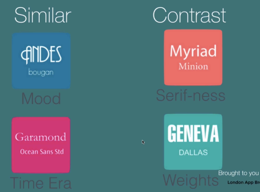
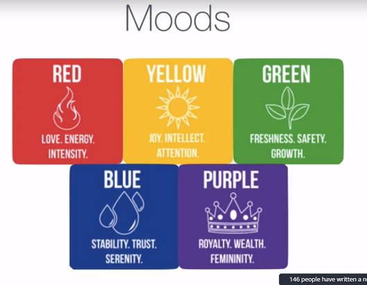

# CSS Tips

- Use Pseudo Classes to Change Style on Change in State

> `:hover` - When the mouse hovers over.

- Giving a Circular Border to an Image

```css
img {
  border-radius: 100%;
}
```

- Give elements multiple classes to mix and match styles.

```html
<html>
  <style>
    .important {
      background-color: red;
    }

    .circular {
      border-radius: 100%;
    }
  </style>
  <body>
    
  </body>
</html>
```

- Circle shorthand:

  - You start from the top and go clockwise, applies to any property that has 4 sides.
  - If you just give two values, it meanse `top+bottom left+right`
  - If you just give one value, it means _all sides_.
  - If you give give three values, it means `top right+left bottom`

- To hide an element:
  - If you want to remove it from the flow of the document itself, use: `display: none;`
  - If you want it to make it invisible, but still take up space and keep its position: `visibility: none;`

* Use `relative: fixed;` if you want a sidebar that stays fixed throughout a page and follows the user if he scrolls.

- You can use the **What Font** tool to find out what font a website uses.

## Design

### Choosing Fonts

Consider these factors when choosing fonts:



- Maximum number of fonts: 3. 2 is ideal.
- One idea is to use Serif for headings, sans-serif for body or vice versa.

### Color Theory



#### Tools for choosing colors:

- colorhunt.co
- flatuicolors.com
- materialpalette.com
- ColorZilla (Chrome/Firefox extension that gets you the hex code of the color of a website)

### Tools for Choosing Icons

flaticon.com
