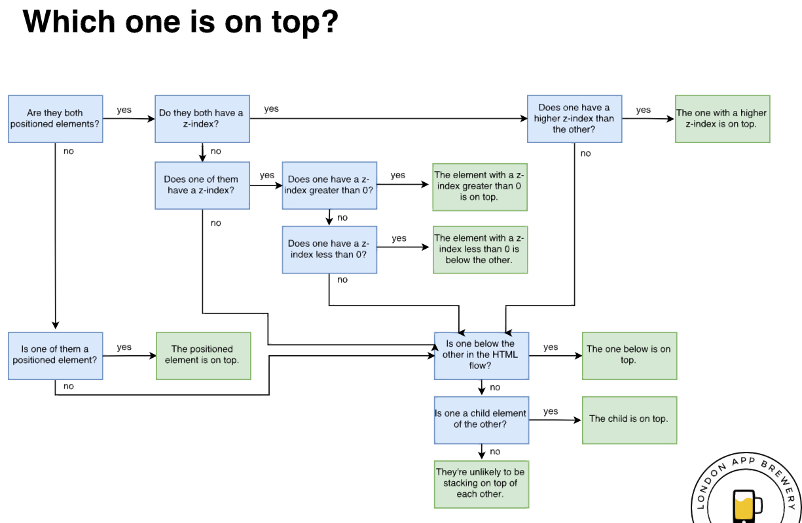
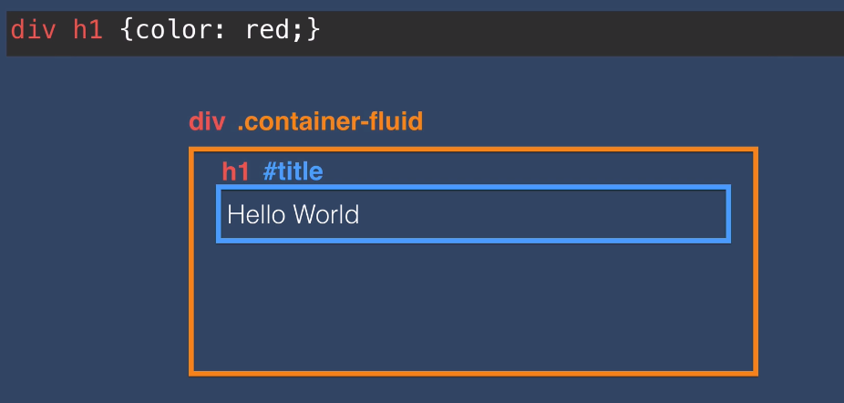
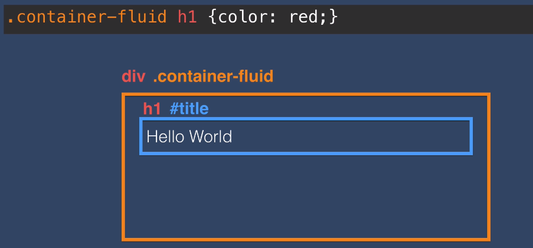
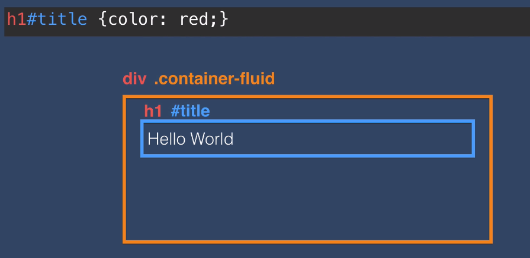

# CSS 2

## Z-Index and Stacking Order

- All elements have a `x` and `y` coordinates, which specify the position horizontally and vertically.
- They _also_ have a `z` coordinate, which specifies if the element is more towards you or away from you (this controls if it's behind or in front of an element.)

### Stacking Order

- The **natural** stacking order for elements is determined by the position of the element in the HTML:

  1. Elements later in the HTML will be stacked on top of its predecessor elements.
  2. Child elements are stacked on top of their parents.

- You can override the stacking order by specifying te `z-index` of the element.

### Z-Index

- All elements have a `z-index` of 0 by default.
- If all the elements have the same `z-index`, the natural stacking order is used.
- The `z-index` is applied **only if the element is positioned**. A positioned element is where its position is not `static` (which is its natural position).
- Elements with a higher `z-index` will be stacked on top of elements with a lower `z-index`.

The rules of stacking can be quite complex, so this image will help decide how elements stack in a document:



## Media Queries

Media queries generally have the following structure:

`@media <type> <feature>`

- **type**: When should it be activated
- **feature**: Query for feature to use

### Examples

```css
@media (max-width: 900px) {
  h1 {
    color: red;
  }
}
```

The above query means, when the view port is **900px or less**, then render all H1 elements as **red**.

```css
@media (min-width: 900px) (max-width: 1000px) {
  h1 {
    font-size: 60px;
  }
}
```

Multiple conditions can be combined. The above means, if the viewport is greater than 900px and less than 1000px, render fonts as 60px.

```css
@media print {
  /* your css */
}
```

Specifies the CSS when you want to display a print friendly version.

## Combining Selectors

1. Multiple Selectors

```css
h1,
h2,
h3,
h4,
h5,
h6 {
  font-family: "Arial";
}
```

The above applies CSS to all heading elements.
The selectors are **comma separated**.

2. Hierarchical Selectors

Format:

`selector1 selector2 {/* css */}`

The selectors are **space separated**.

### Examples



> The browser will read the selector from **right to left**.

So in the example, it will look for `h1` elements _inside_ any `div`, and color them red.



This will apply the color red to all `h1` elements that are _children_ of elemments that have the `class` "container-fluid".

### Important



- When there is **no space**, you read from **left to right**.
- So in the example above, the browser looks for an `h1` element that has an `id` of "title".
- Only if there is a space between selectors will it be a **hierarchical selector**, so it would be read from **right to left**.

> What's the difference between `element.class` vs `element .class`


- In the above example, both `h1` elements have the same class.
- However, by putting a space between the class names, you're specifying that class-2 is a child of class-1, there by being able to target the first `h1`.
- If you removed the space to make it `.container.title`, nothing would turn red - because the browser will look for elements with `class="container title"`

## Selector Priority

```css
h1 {
  color: red;
  color: green;
}
```

- The browser will read it top to bottom.
- The last CSS rule run, will be what's applied - so the color will be red.

```css
h1 {
  color: red;
  color: green;
}

.title {
  color: yellow;
}
```

- Classes have a higher specificity than elements.
- So any `h1` elements that have the class "title" will be **yellow**, _not_ red.

```css
h1 {
  color: red;
  color: green;
}

.title {
  color: yellow;
}

#heading {
  color: blue;
}
```

- IDs have the highest priority/specificity, so it will override any other conflicting rules.
- In the browser inspect, you will see the colors being struck out, and being overriden by the highest specific rule.

> In order to avoid debugging issues from CSS rules being overriden by more specific selectors, use **IDs sparingly**! Stick mainly to classes.

## Best Practices

1. Avoid inline styles!
2. Use IDs sparingly!
3. When using your own custom CSS classes, assign each element only one class instead of combining classes - because it helps avoid conflicts.
