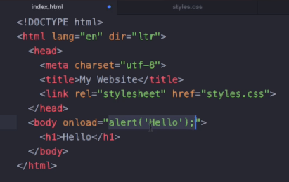
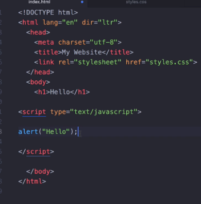
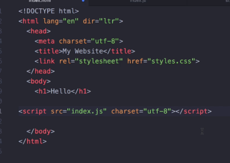

# The Document Object Model (DOM)

The DOM can be thought of as a catalogue of all the HTML elements that make up a page, arranged into a tree structure that can be manipulated.

## Including Javascript in a HTML file

There are 3 ways to do so:

1. Inline (as part of an element)



> This way of incorporating javascript is discouraged as it' not modular and difficult to debug.

2. Internal

Including it as part of a script tag.



3. External File



### Note

1. The position in which we put the script tag (or inline javascript) matters a lot - because it affects when the code gets executed.
2. With CSS, we always put the CSS styles in the head, so that the moment the page loads the styles is applied.
3. However with Javascript, we don't include it at the top, because it may refer to an HTML element that has not been executed yet!
4. The best place to place the `script` tag is just **before** the closing `body` tag.

## API

- Objects inside the DOM have both properties and methods.
-

### innerHTML and textContent

- **innerHTML**: _Any_ content inbetween a tag and its closing tag.
- **textContent**: Only the string text inside an element (does not include child elements).

```html
<body>
  <p id="p-id"><strong>Hello</strong></p>
</body>
```

```javascript
const p = document.querySelector("#p-id");
btn.innerHTML;
// <strong>Hello</strong>
btn.textContent;
// Hello
```

### style

> \*\*It's bad practice to use this method - use `element.classList` instead!

Inline CSS styling.

When you want to set some styling, all CSS values are strings, and all CSS properties are **camel cased**.

```javascript
document.querySelector("#someid").style.color.backgroundColor = "yellow";
```

### document.getElementsByTagName

Returns an **iterable collection** of elements that match the given tag name.

```javascript
document.getElementsByTagName("li");
```

- Note that Elements is plural -> this means its going to return a collection.

### document.querySelector

Returns the **first** element that satisfies your selector.

```javascript
document.querySelector("li a");
```

The above will return the first anchor tag that is a child of a `li` element.

### document.querySelectorAll

Will return a collection that satisfies the given selector.

### element.classList

Every DOM object has a property called classList, which is a set of all classes attached to the DOM node.

Below is how you'd add, remove or toggle classes from an element.

```javascript
const button = document.querySelector("#some-button");
button.classList;
// ['btn', 'xlg']
button.classList.add("invisible");
// ['btn', 'xlg', 'invisible']
button.classList.remove("invisible");
// ['btn', 'xlg']
button.classList.toggle("invisible"); // If it's present, it's removed, else it's added.
// ['btn', 'xlg', 'invisible']
```

### Manipulating attributes

```javascript
const a = document.querySelector("#anchor-id");
a.attributes;
// Map of button attributes
a.getAttribute("href");
// "www.google.com"
a.setAttribute("href", "bing");
```
