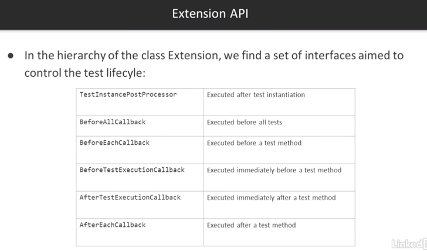

# JUnit

* JUnit4 is not modular and consists of a single JAR.
* JUnit5 is created from scratch using Java 8 - allows you to take advantage of features such as lambdas.
* JUnit5 has multiple dependencies.

* Platform is for launching tests on the JVM (e.g. Provides an API for other libraries like Cucumber to use it)
* Jupiter - new API for writing tests
* Vintage - backward compatability for the old JUnit API 3 & 4

# Extensions

# Testing

## Standard Tests

`@Test` annotation identifies a method as a test. This does not take any attributes.

## Assertions

An assertion consists of 3 parts:

1. The expected value
2. The real outcome
3. The comparison of expected to real

## Tagging and Filtering

## Conditional Test Execution

## Nested and Repeated Tests

## Dynamic  Tests

