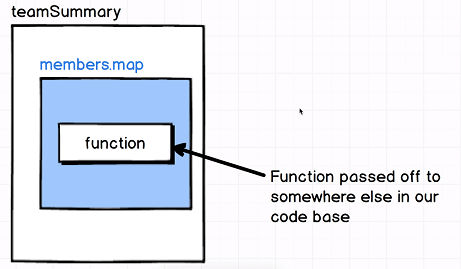

# Fat Arrow Functions

## Syntax

In ES5:

```javascript
var add = function(a, b) {
  var sum = a + b;
  return a + b;
};
```

In ES6:

```javascript
const add = (a, b) => a + b;

const subtract = (a, b) => {
  const result = a - b;
  return result;
};

const double = x => x * 2;
```

- We use a fat arrow instead of function for function expressions, which is shorter syntax.
- If the function can be written in _one line_, we can omit the braces and the `return` statement, and just write the function in one line - whatever the expression is automatically returned.
- If the function spews over a line, then you have to use braces and a return statement.
- If your function has _exactly **one** argument_, you can drop the parenthesis.

## When to use

```javascript
const team = {
  members: ["Jane", "Lisa"],
  teamName: "Super Squad",
  teamSummary: function() {
    return this.map(function(member) {
      return `${member} is on team ${this.teamName}`;
    });
  }
};
```

When you run the above function, you will get the following **error**:

> TypeError: Cannnot read property 'teamName' of undefined



When you define an anonymous function, it gets passed off someplace else in the code base. It has no access to `this`.

### Solve it the ES5 way

```javascript
const team = {
  members: ["Jane", "Lisa"],
  teamName: "Super Squad",
  teamSummary: function() {
    return this.map(function(member) {
      return `${member} is on team ${this.teamName}`;
    }).bind(this);
  }
};
```

Bind the function to the object.

### Solve it the JQuery Way

```javascript
const team = {
  members: ["Jane", "Lisa"],
  teamName: "Super Squad",
  teamSummary: function() {
    var self = this;
    return this.map(function(member) {
      return `${member} is on team ${self.teamName}`;
    });
  }
};
```

Cache a reference to `this` and reference `this` in the function.

### Solve it the ES6 Way

- Replace the anonymous function with a fat arrow function - this is what they're designed to do.
- Fat arrow functions utilize _lexical `this`_.
- Which means that `this` references to the current context. In the example, `this` gets replaced with the variable name `team`.

```javascript
const team = {
  members: ["Jane", "Lisa"],
  teamName: "Super Squad",
  teamSummary: () => {
    return this.map(function(member) {
      return `${member} is on team ${this.teamName}`;
    });
  }
};
```
