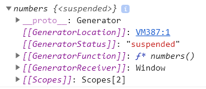
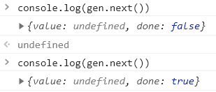
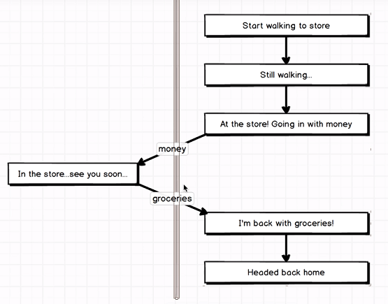
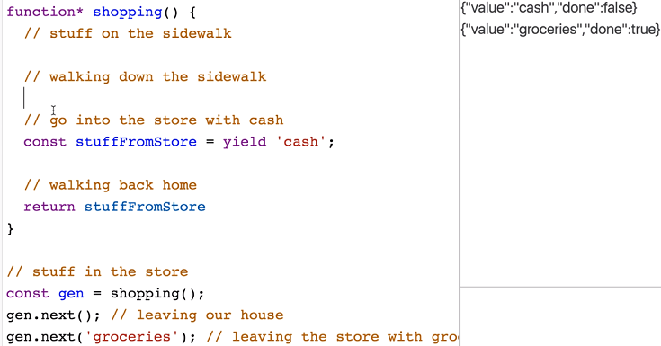
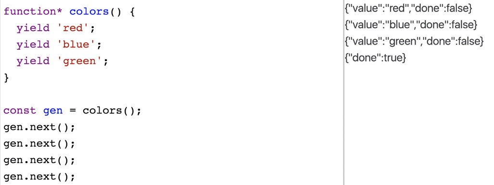
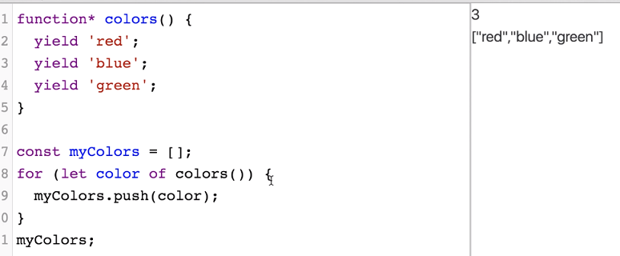
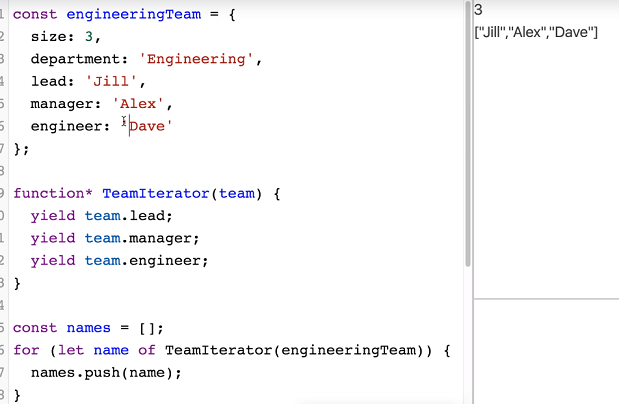
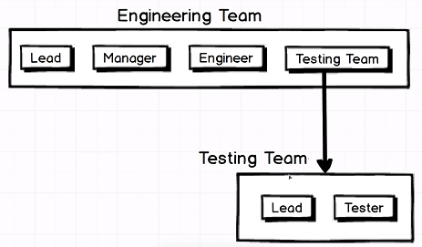
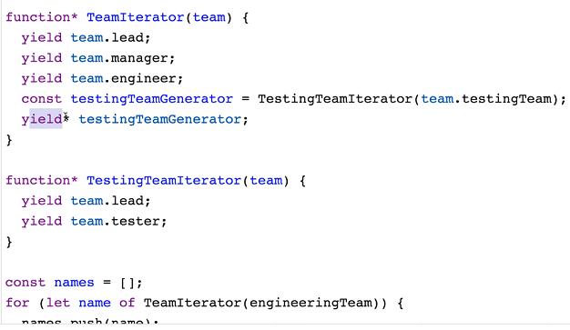
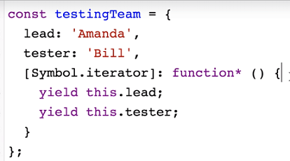

# Generators

## The "for of" iterator

This is a way of iterating over objects:

```javascript
const names = ["ferrari", "lambo"];

for (const name of names) {
  console.log(name);
}
```

- We need to know about this, because generators can only be used in this iteration method (forEach, etc can't be used with generators).

## Definition

> A generator is a function that can be entered and exited multiple times.

A regular function simply runs in its entirety just once (or however many times you call it).

Another way of defining a generator is that it is a function with multiple entry and exit points.

## Syntax

To define a generator:

```javascript
function* numbers() {
  yield;
}
```

- Note the "\*" can either be to the right of `function` or to the left of "numbers".

## Exploration of a Generator Function

```javascript
console.log(numbers());
```

Outputs:



If we write the following code and console log it:

```javascript
const gen = numbers();
console.log(gen.next());
console.log(gen.next());
```



> Note: If we removed the `yield` keyword, "done" would always be `false`.

## A Generator Analogy



- In the analogy, the world of the "store" is on the left side, and is completely different to the world of the "sidewalk" on the right.
- We transition from the sidewalk to the store, then back to the sidewalk.

### Analogy in Code Form



- When we first called `next()` on the generator, it starts executing code until the first `yield` keyword.
- In the function, all the sidwalk logic happens until we need to go into the store, which is the first `yield` keyword - and where the transition begins.
- We call `next()` again and pass in the end result of completing the store logic (i.e. the groceries) to the generator.
- The generator resumes execution and returns the result.
- We can have multiple `yield` keywords, and we have to have the same number of `next()` calls for the generator to complete (in addition to the first `next()` which starts the execution).
- **Note:** The output on the top right shows the return result at the end.

## Generator Use Case



> Generators can be used for iterating over arbitrary objects.



- This is where the `for of` iterators come in.



## Generator Delegation

This is where we delegate the _next generation_ to **another** generator.

For example, given a scenario where we want to print out all the members of a team, that is comprised of another team, we'd first return all the members of our team, and then hand over (_delegate_) generation of the rest of the members to the other team.



**This achieved using `yield*`**.



## Symbol.iterator

- The above code examples have quite a bit of boiler plate.
- One of the primary use cases of generators is to iterate over arbitrary objects using the `for of` iterator.
- The `Symbol.iterator` is special syntax for Javascript objects to mark iteration generators for objects.



The above can be further sugared to:

```javascript
const testingTeam = {
  lead: "Amanda",
  tester: "Bill",
  *[Symbol.iterator]() {
    yield this.lead;
    yield this.tester;
  }
};
```
