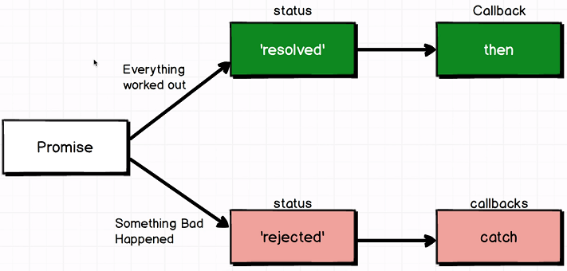

# Promises

## How Javascript Executes Code

There is no way in Javascript to "pause" the execution of code (like `sleep(1000)`).


In the above example, `console.log(data)` would be `undefined`. Because it will be executed immediately after the `makeRequest` function.


This is what we want - to only execute code once the long running process has completed.

## Terminology




`then` and `catch` are _properties_ of **Promise** objects that are for registering callbacks on success or failure.

## Creating Promises


The above throws an error because it request one argument to be passed - a callback:

```javascript
const promise = new Promise((resolve, reject) => {
  //some long running code
  if (result === "success") {
    resolve();
  } else {
    reject();
  }
});
```

If you didn't call resolve or reject, the status of the promise would be **"pending"**. E.g:


It's up to us to decide when to resolve or reject a promise, which will change the state of the promise.

**You can pass in any object to `resolve` and `reject` to share the result.**

What happens when a promise is rejected?


## "then" and "catch"

- By calling `resolve()` we indicate a promise was a success.
- By calling `reject()` we indicate that the promise failed.
- We need then need a way to determine what should happen if a promise fails or succeeds.
- We do this by registering callbacks to a promise's `then` and `catch` properties.

```javascript
const promise = new Promise();

promise
  .then(() => {
    console.log("an outstanding success");
  })
  .then(() => {
    console.log("another success!");
  });
// then and catch callbacks can be chained!
promise.catch(() => console.log("A fail"));
```

## all() and race()

```javascript
const promise1 = new Promise((resolve, reject) => {
  resolve("Promise One has resolved");
});

const promise2 = new Promise((resolve, reject) => {
  resolve("Promise 2 has resolved");
});

const promiseArray = [promise1, promise2];

Promise.all(promiseArray).then(data => {
  console.log(data);
});
```

The output will be:

> ["Promise One has resolved", "Promise 2 has resolved"]

_`Promise.all([Promise...])` takes an iterable of promises and exectues **only when all** of them resolve._

```javascript
Promise.race(promiseArray).then(data => {
  console.log("One of the promises are done, I don't care which one!");
  console.log(data);
});
```

**`race()` will execute once _one_ of the promises have resolved.**
