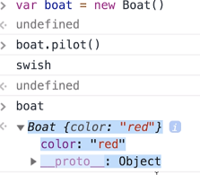
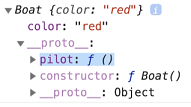
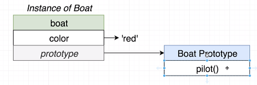
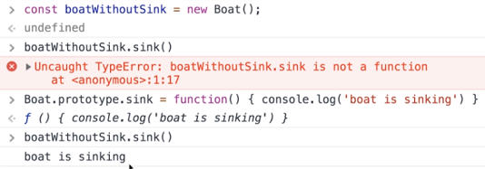

# Prototypes

- Javascript implements inheritance using _prototypes_, which is a compositional way of implementing inheritance.
- Every Javascript object has a reference to its `prototype`.

## Example

```javascript
class Boat {
  color: string;

  pilot(): void {
    console.log("swish");
  }
}
```

This is actually transpiled to ES5:

```javascript
var Boat = (function() {
  function Boat() {
    this.color = "red";
  }
  Boat.prototype.pilot = function() {
    console.log("swish");
  };
  return Boat;
})();
```

What the above code does is:

- Define a constructor function
- The fields are initialized
- Methods are attached to the **prototype of Boat**.

### What happens when you inspect a Boat object in Chrome's console?



- The `boat` variable can call `pilot()`.
- But if you inspect `boat`, Chrome does not show a method attached.

If you expand the `__proto__` field:



- You see the `pilot()` method is present.
- **IMPORTANT:** `boat`'s `__proto__` field does not actually exist - it's simply a convenience feature of Chrome's dev tools!



The above conceptually shows what is going on.

**Notes:**

- We can dynamically add methods to the Boat class, i.e. after writing the class definition!
- We do this by simply adding a method to the prototype property of a Boat object!



The above shows:

- A object of `Boat` which _doesn't_ have a `sink` method.
- We then add a `sink` method to the `prototype` of `Boat`.
- Now all objects of `Boat` have a `sink` method!
- **The implication is that we can dynamically add and remove methods from _all_ _instances_ of a class in Javascript!**
