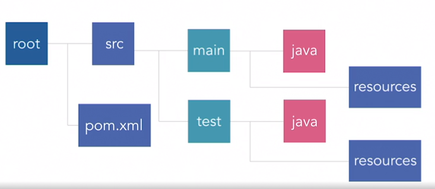
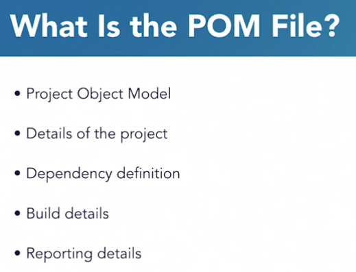
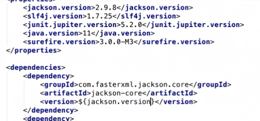
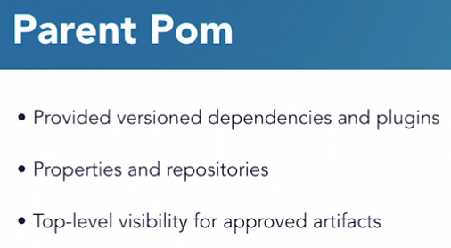
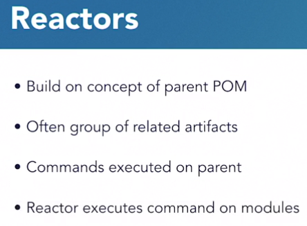
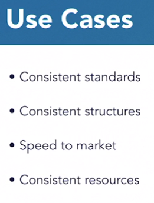

# Maven

Go to https://maven.apache.org for information on how to configure plugins.

## Java Project Structure

## POM Overview

### Project Information Section

* **groupId**: The group the project belongs to - an organization a project belongs to in a Maven repository.
* **artifcatId**: Common name for the project
* **Version**: Project version - typically semantic versioning. Can also include qualifiers such as snapshot or release.

### Properties Section

Purpose:
* Reduce duplication.
* Streamlines configuration.
* Helps keep items in sync - especially versions of a library. Most common use of properties.

### Build Section

* You use plugins to handle the build.
* Plugins are specified similar to dependencies, but have configuration options and can be executed via CLI.
* `mvn clean package`: `clean` deletes all old build info. `package` builds the JAR file.
* When **scope** isn't provided, the *default* scope is **compile**.

### Reporting Section

* In CLI you can use: `mvn clean package site`
* You use `package` so we can capture compilation and test information. The `site` command is what actually generates the documentation.
* Reports will be in `target/site`

## Parent Poms

* Provides a list of dependencies and versions that a child POM can leverage, allowing you to standardize in one place.
* Child POMs don't specify the versions, just the dependencies.
* This essentially allows you to manage dependencies, licenses and versions in one place.

### Reactors

* Reactors build on the concept of a parent POM.

## Archetype

* A project template using maven.
* You specify them when starting a project.
* Maven will build the project structure for you.
* Great for teams that want consistency in their artifacts.

* When you want resources in a specific location for the project to work.
