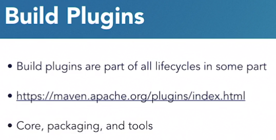

# Builds

* Goals are individual tasks in a phase.
* Particularly useful when you don't want to run full phases, only when you want a specific output of a plugin, like sure-fire.

## Build Plugins

### Core Build Plugins

* Core plugins are most used.
* Compilation plugin: uses the JDK to compile source code to bytecode.
* Installation plugin: Take the package artifact and installing it into your local M2 repository
* Deployment plugin: To deploy your package artifact for others to use. Deploy your artifact that is installed in your local .m2 repo to a central repository.
* Validation plugin: To validate your source code.
* Packaging plugin: Responsible for packaging bytecode into a system like a JAR.

#### Packaging

* JAR - Java Archive. Consumed by JVM.
* WAR - Web Archive. Consumed by web app servers like Tomcat.
* EAR - Enterprise Archive. Consists of WARs, JARs, and EJBs. Consumed by Enterprise Application Servers like GlassFish.
* SHADE - Special JAR that includes all the classes from your code, as well as dependency classes needed for an UBER JAR. Helps build a self-contained JAR.

### Other Plugins

* There are various plugins, such as for dealing with **resources**, **deployment** and **reporting** (surefire).
* Resources plugin copies all your resource files (or files specified elsewhere) into your JAR for consumption.
* The **Maven Failsafe** plugin is useful for integration testing. It allows you to put your integration tests in a separate structure in your project and then run them as part of your build process.

## Build: Tools Plugins

* Tend to be very configuration heavy.
* Go to the **tools** section in the Apache Maven Plugins page.
* The **dependency** plugin is the most heavily used.
* The **enforcer** plugin is used to make sure everyone in your organization follows your rules - such as versions of Maven and Java, banned plugins, etc. **SonarType** plugin can prevent the use of insecure stuff.
* The **jarsigner** allows you to sign the JAR artifact with a PKI key. You can ensure only JARs signed by your organisation are used.
* The **release** plugin is very useful: It allows you to build a project and release it. E.g. Tagging the project in your SCM and the deploy it. Used in CI. *If you're using Git, you have to be very careful with how you use this plugin.*

## Packaging Plugins

Used to specify what type of final packaging your Java ends up in - EAR, WAR, JAR etc.
