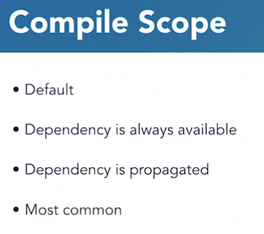
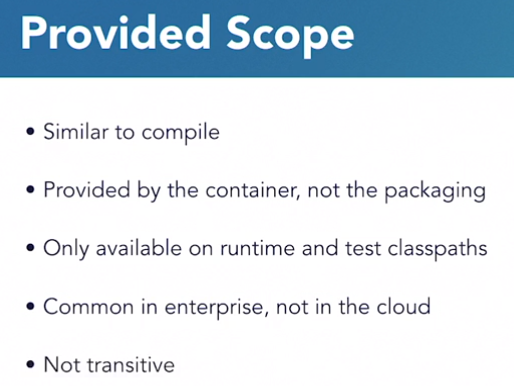
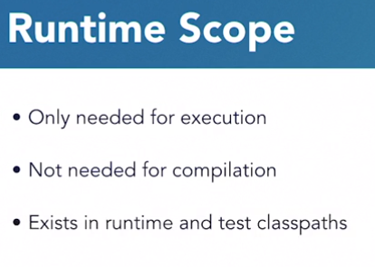
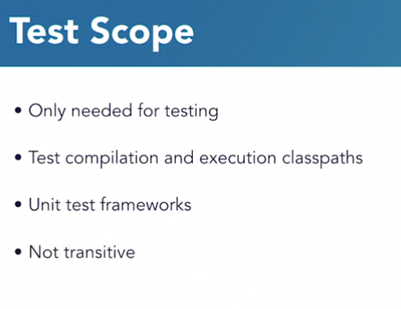
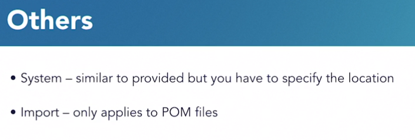
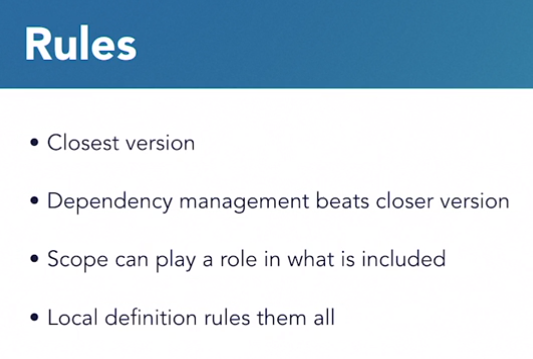
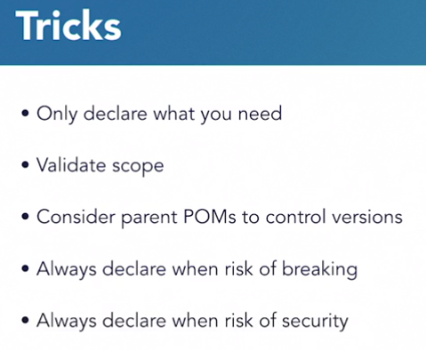
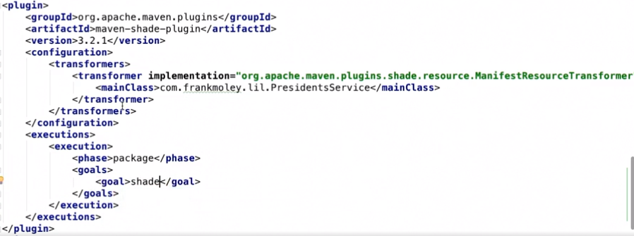

# Dependencies

## Scope

1. Compile Scope



2. Provided Scope

This basically means the dependency will be provided to the package at runtime via the container, etc 
and is not to be included in the package itself.



3. Runtime Scope



4. Test Scope



5. Other Uncommon Scopes




## Transitive Dependencies

* These are dependencies of dependencies.



* By "closest version" we mean: If there is a transitive dependency, where two dependencies depend on the different versions of another dependency, like this: 

A -> B -> C -> D -> Z.1.0.2

And B depends on Z.1.0.1

The version Z.1.0.1 because B is the closer dependency. D is separated from B by 2 degrees.




## Some Dependency Goals

```bash
mvn dependency:analyze # Will warn about dependencies, such as unused dependencies
mvn dependency:resolve # Show dependencies
mvn dependency:tree # Show dependencies in tree structure
```

## Uber Jar AKA Shaded JAR

* Contains all source code
* Contains all libraries
* Can be executable


