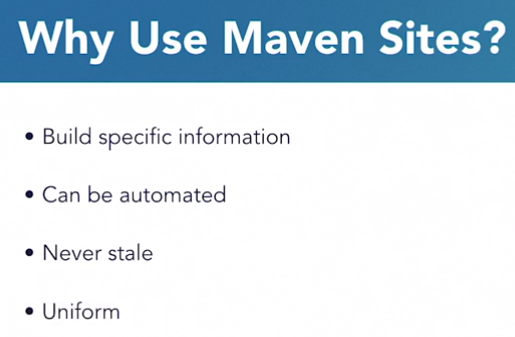
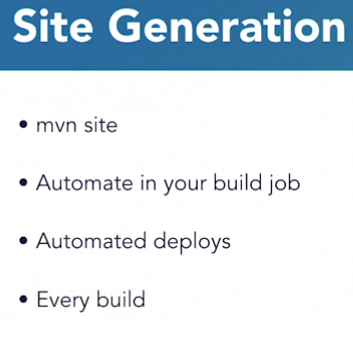
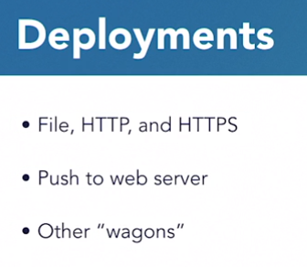

# Maven Sites

* Maven Sites by default are ugly. Go to the creating skins section in the Maven website.

## Different Plugins

* The `changelog` plugin gives a report for your recent changes in SCM. Will require SCM configuration to do.
* The `checkstyle` allows you to create rules for your code standards.
* The `javadoc` can be a build or report plugin. Generate doc from your source code.
* The `surefire` plugin is for test execution and coverage.
