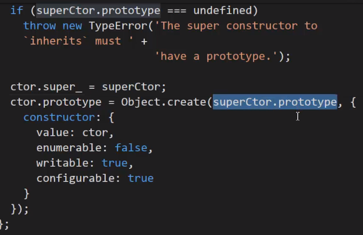

# Event Emitter

## Inheriting from the Event Emitter

When you want to inherit the properties and methods from the Event Emitter, you shuld use the
`utils.inherits` helper from Node.

This essentially assigns the prototype of your object to the Event Emitter, maintaining the prototype chain
and allowing you to add your own methods/properties to the prototype as well.

**It's important that you add your props to the prototype, _after_ inheriting from Event Emitter**

### Making the appropriate "super constructor" call

- We need EventEmitter to run all it's methods on the correct object.
- `util.inherits` simply connects all the prototypes.
- We need to set **all** the methods of the prototype to point to our current object, so they run correctly.

> **Note:** If using ES6 classes, you don't need to do any of the above! It just involves extending from EventEmitter. _Notes ES6 classes is just sugar._
