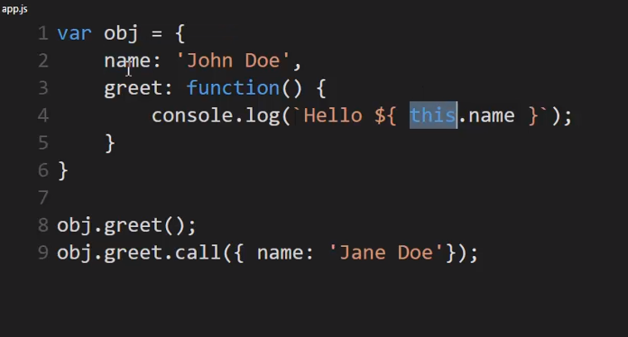
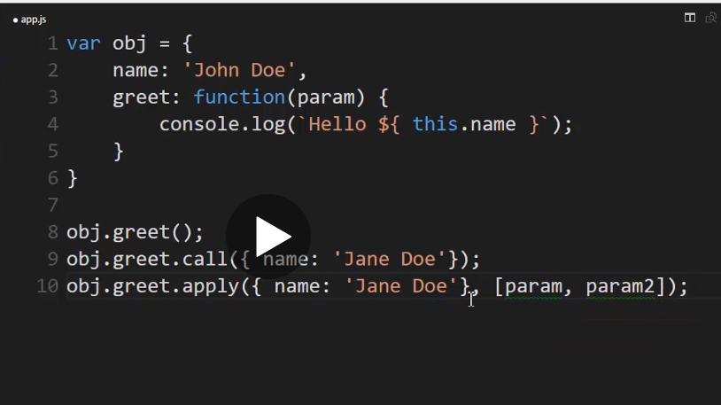

# Javascript

## Call

- Functions are first class objects. They have properties and methods as well.
- `call` is a method on all functions. If a function makes a reference to `this`, you can use `call` to set what `this` points to!

In the example above, `call` invokes the `greet` function in **another** object, but sets its `this` to the new object `{name: 'Jane Doe'}`.

## Apply

- It is nearly identical to call, except that when you pass parameters, you pass them all in a single array.
- In `call`, you'd have to pass them as separate comma separated arguments.

