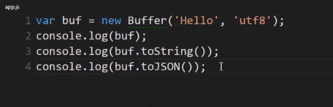
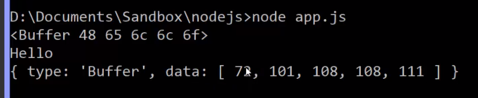

# Asynchronous code, libuv, The Event Loop, and more...

- NodeJS is asynchronous. Javascript (and V8) are **synchronous**.


- libuv is used to interact with the operating system, and is the basis of events emitted from the OS.


- `Buffer` is a globally available class in NodeJS.

```javascript
let buf = new Buffer("Hello", "utf8");
```

- Buffer will convert the string 'Hello' to binary data, and encode it as 'utf8' (which is the default).





## Typed Arrays

- Javascript used to be unable to deal with raw binary data.
- Because of that, Node provides the Buffer class.
- However with **ES6**, we can deal with binary data using typed arrays.
- More info: https://developer.mozilla.org/en-US/docs/Web/JavaScript/Typed_arrays
