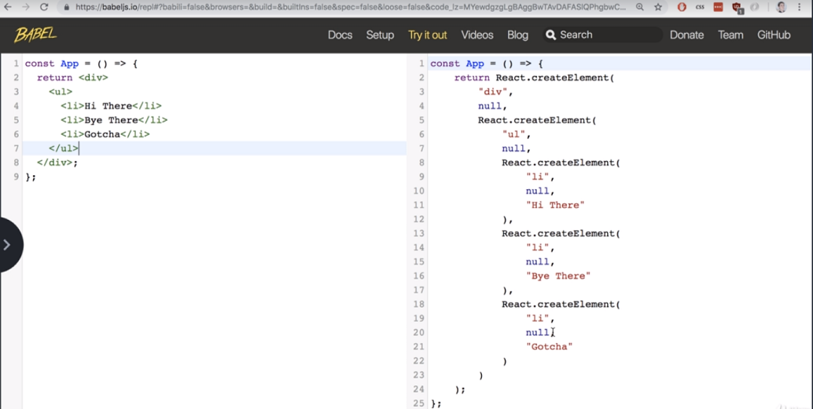
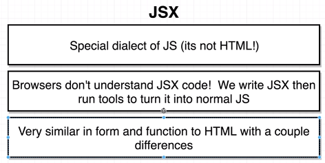
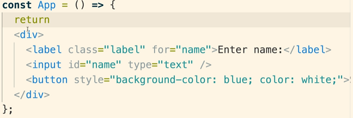
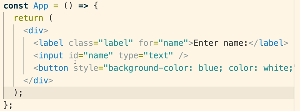
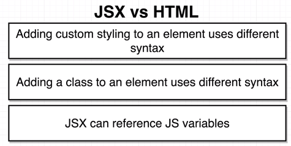
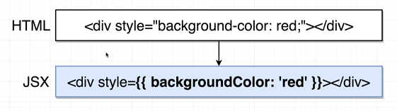
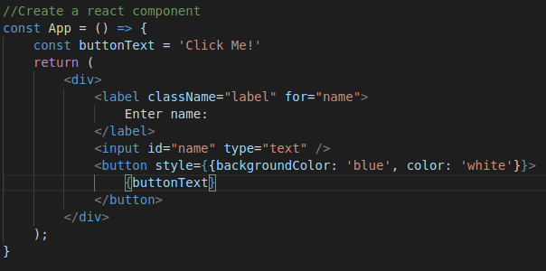

# Section 2 - Building Content with JSX

## L14

- We don't ship ES2015 code, as the user's browser may not support it. Instead, we use Babel to convert it to an older standard (ES5).
- Babel is also used to process JSX. JSX is actually converted to normal JavaScript code - the browser does not understand JSX.

## L15 and L16

- JSX is very similar to HMTL.
- The opening tag of the JSX needs to be on the same line as the return statement - otherwise JavaScript returns nothing!

### Diferences between JSX and HTML

1. Custom styling uses different syntax

Note:  Double quotes are removed, and replaced with double brackets. Dashes are removed, and the next letter is capitalized.
Double quotes means its representing a JS object.

Note about double quotes: JSX requires property values to be enclosed by double quotes. However by convention, use single 
quotes for fields in a JS object.

2. "class" in HTML should be renamed to "className" in JSX. Why? To prevent collisions with JS class declarations.

3. You can reference JavaScript variables and functions inside JSX by enclosing them with single curly braces.

- You can reference strings, numbers and arrays (however array values are concatenated if displayed).
- If you try to refer a JS object in a place where **you try to show text**, React will not know how to display it and throw an error. You can show the specific fields of the object however.

4. There are many other minor differences between HTML and JSX. However, most of those changes won't break your app. To catch those errors, launch the app in the browser, right-click on the page and select "Inspect". Navigate to "Console" to see all the errors react throws. For example, "for" in the JSX code shown previously, should be "htmlFor".

