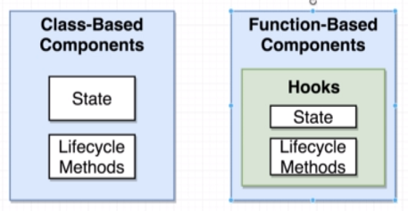
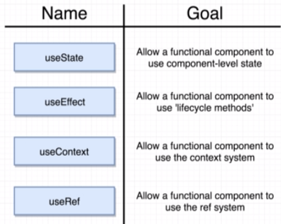
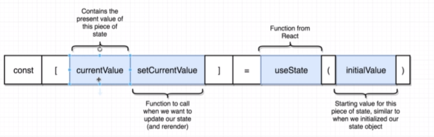
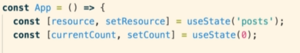

# Section 25 - Hooks

**Purpose of Hooks**

* Why learn hooks? Because they make it easy to share logic between different components.

* **Only the latest version of React has hooks. create-react-app does not install this! So make sure you run the following command:**

`npm install --save react@next react-dom@next`

## Some Hooks Available to You in React and their Purpose

## useState Hook Initialization

## Multiple useState Hooks can be used!

* The useEffect hook is like combining `componentDidMount` and `componentDidUpdate`.
* The useState hook is like initializing and setting state.
* **If you call useEffect without passing an array in the second argument, it will execute the first argument *constantly***
* For **useEffect**, if you pass in only an empty array in the second argument, it's the same as componentDidMount (only called once).
* Also, if you keep passing in a new object whose values are the same, it will be executed continuously - because the object refs will be different.
* **You cannot pass in an async or Promise returning function with useEffect!!!** So you will have to wrap the async function with a non-async function.