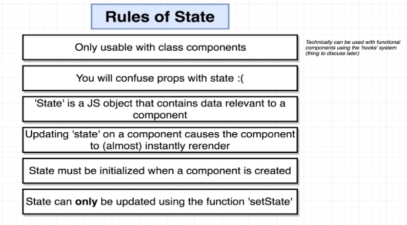

# Section 5 - State in React Components

## L51

**Rules of State in React:**

## L53 - 55

* State can only be updated using the function `setState`. **This is the most common problem encountered by new React programmers, as they try to set state using regular JavaScript mechanisms**.
* State can only be directly called upon *initialization* in the **constructor**.
* If you want to use state, you have to use the **state** property (which is defined in the super class).
* **Every time you want to re-render a component, update its *state*!**
