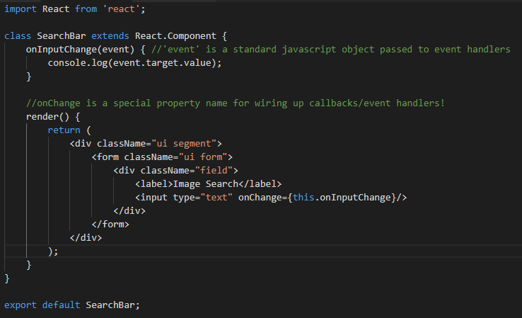
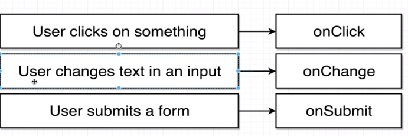
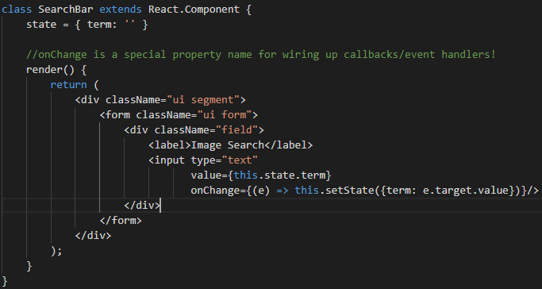
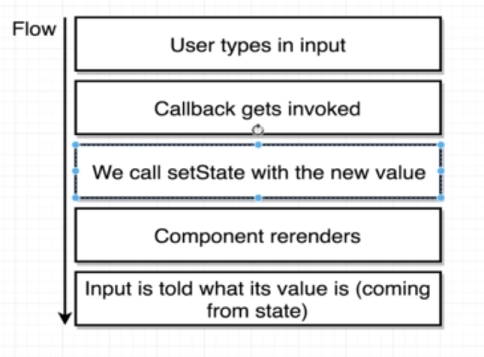
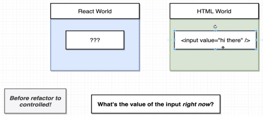
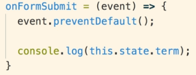
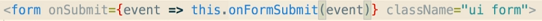

# Section 7 - Handling User Input with Forms and Events

## Event Handling
------------------

Example basic event handling:





Some special methods for passing user events to callbacks:





* Not all elements support these methods - e.g. div does not support onChange, since it does not change. However it does support onClick.


## Controlled Elements
-----------------------

The code shown previously, depicted an uncontrolled element.
Below is code for a controlled element:





This is the flow of the controlled element:





**What about the above code and flow makes it controlled?**
You're able to answer the question, *What's the value of the form at **any point** in time?*
Without a controlled element, you'd have to reach into the HTML DOM to answer the above question. The only period of time React could answer this question, is when the callback registered with onChange was running.
A controlled element's state would be constantly updated with the value, and is driven by React.





## JavaScript, Undefined and This
----------------------------------

* In JavaScript, there is an object called `undefined`. Whenever you try to call a method or property from that object, you would get an error similar to:
`TypeError: Cannot read property '<x>' of undefined`
* In React, it's very common for you to come across this error **because of JavaScript's rules when handling the keyword `this`**.
* The rule in JavaScript for `this`, is, `this` is substituted for the type to the left of the dot.
E.g:

```javascript
class Car {
    sound = 'vroom';
    makeSound() = this.sound;
}

const car = new Car();

class Truck {
    sound = 'putputput';
    makeTruckSound() = car.makeSound();
}
```

```shell
> truck.makeTruckSound()
putputput
```

In other languages, `this.sound` would have referred to the Car object. However according to JavaScript's rule, `this` would be 
substituted with `truck`, the variable to the left of the calling method at the top of the tree.
So
`makeSound() = this.sound;`
becomes
`makeSound() = truck.sound;`

If you tried to run `makeSound()`, without any variable to the left of it, you would get:
`TypeError: Cannot read property 'sound' of undefined`


**This is something you need to be mindful of when passing callbacks in JavaScript and using `this`.**
**Whenever you use a function, you will have a broken `this`.**


### Fixing the broken 'this'

**FIX 1**
If you use the arrow function syntax, it automatically binds `this` to the correct instance.
E.g.:




**FIX 2**
When passing a call back, instead of passing the function name, pass an anonymous function that invokes the event handler, like this:


