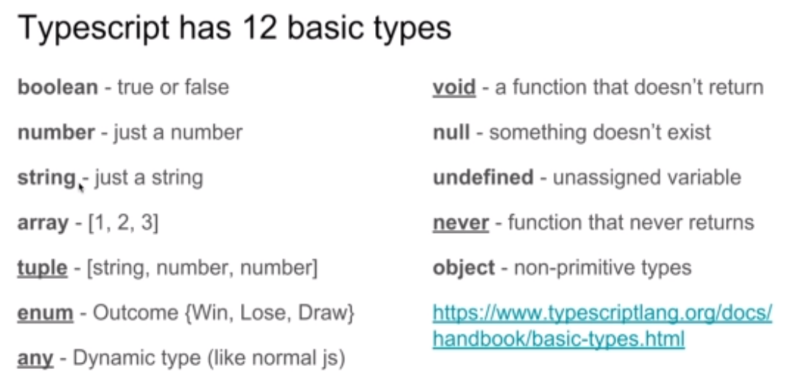

# TypeScript and React

## Useful VS Code Plugins

* Night Owl Theme - Coding at night
* Bookmark - help you bookmark code
* Bracket Pair Colorizer 2 - very useful!
* ES7 React/Redux/GraphQL/React-Native snippets
* Import Cost plugin - how big your imports are
* Prettier Code Plugin - one of the most popular formatters for frontend development
* Fira Code - lovely font for coders. Install using `choco install firacode`

## What is TypeScript

* `tuple` is like an array, but allows different types. Arrays only accept one type.
* `enums` give friendly names to a set of values.

## Installing TypeScript into a create-react-app

* `npm install typescript`
* `@types/node`
* `@types/react`
* `@types/react-dom`

## Configuration

When you run `npm start` for the first time, it will create a `tsconfig.json`, which has all the config for TypeScript.

