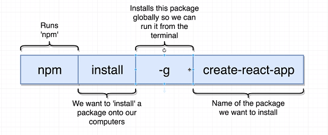
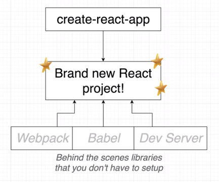
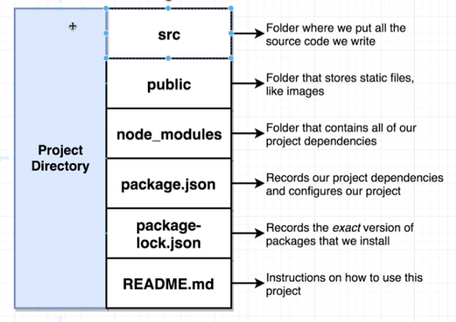
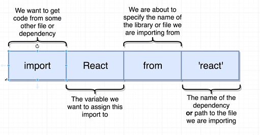
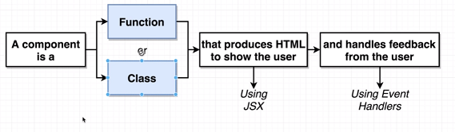

# Section 1

## L3

- React is a Javascript library specialized in handling user interaction and displaying content.
- In ES2015, Javascript introduced support for classes.
- React 'components' (most basic pieces of React), which are made using either JS classes or functions.
- In the render() method of the example, the similar HTML looking code is actually JSX code.
- JSX looks like HTML and can be placed inside Javascript. Determines the content of a react app.
- The 'react' library knows what a component is and how to make components work together.
- The 'react-dom' library knows how to make a react component show up in the DOM as HTML.

## L4

- Install Node.JS
- Install create-react-app:

`sudo npm install -g create-react-app`

- Generate new react project:

`create-react-app <app-name>`



## L5

- All modern browsers support Javascript ES5. ES2015 is almost completely supported.
- However support for versions after that is not widespread.
- Babel is a commandline tool that can convert Javascript into different versions - so you can guarantee compatibility.
- It is included in create-react-app, among other packages.



## L9

- To run a react app, type npm start. The react app will run in the browser.



## L10

To create a basic react app:

    1. Import the React and ReactDOM libraries
    2. Create a react component
    3. Take the react component and show it on screen.





- Every file we create, is essentially its own tiny little universe (i.e. completely independent from other files until you use import)
- JS looks inside the node_modules dependency by default 
- import statements refer to ES2015 JS modules. Alternate is the common JS module system, which uses the require statement.
- A simple component

```javascript
const App = () => {
    return <div>Hi there!</div>;
}
```

The above is ES2015 standard. The older way of doing it is:

```javascript
const App = function () {
    return <div>Hi there!</div>;
}
```
